# LLM驱动的A股量化因子挖掘Agent

## 完整项目架构与第0—4步实施设计

> 项目目标：构建一个可解释、可复现、可审计的量化因子挖掘Agent，完成“确定研究规则 → 提出假设 → 实现因子 → 回测验证 → 迭代改进 → 因子入库”的完整闭环。  
> 目标市场：中国A股。  
> 数据基础：本地MySQL数据库。  
> 因子评价与回测框架：Microsoft Qlib。  
> 因子实现：Qlib表达式与Python扩展。  
> 参考框架：QuantaAlpha的假设驱动、AST约束和Trajectory进化方法，并针对数据泄漏、A股交易规则、因子中性化和研究治理进行增强。

---

## 目录

1. [项目结论与设计原则](#1-项目结论与设计原则)
2. [完整总体架构](#2-完整总体架构)
3. [第0—4步统一接口](#3-第04步统一接口)
4. [标准研究工件](#4-标准研究工件)
5. [全局状态机与错误路由](#5-全局状态机与错误路由)
6. [第0步：确定研究规则](#6-第0步确定研究规则)
7. [第1步：提出可检验假设](#7-第1步提出可检验假设)
8. [第2步：实现可执行因子](#8-第2步实现可执行因子)
9. [第3步：评价与回测验证](#9-第3步评价与回测验证)
10. [第4步：诊断、进化与因子入池](#10-第4步诊断进化与因子入池)
11. [数据、字段与PIT系统](#11-数据字段与pit系统)
12. [算子库](#12-算子库)
13. [因子库](#13-因子库)
14. [实验库、轨迹库与经验库](#14-实验库轨迹库与经验库)
15. [数据库与文件存储设计](#15-数据库与文件存储设计)
16. [端到端一致性示例](#16-端到端一致性示例)
17. [MVP开发路线](#17-mvp开发路线)
18. [项目验收标准](#18-项目验收标准)
19. [跨步骤一致性审计](#19-跨步骤一致性审计)
20. [核心结论](#20-核心结论)
21. [参考资料](#21-参考资料)

---

# 1. 项目结论与设计原则

## 1.1 项目的核心不是“多个LLM互相聊天”

本项目本质上是一个由确定性程序控制、由LLM提供研究语义能力的量化研究系统。

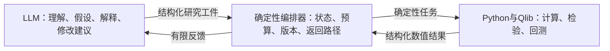

LLM“不”负责：

- 计算IC、RankIC、Sharpe和最大回撤；
- 判断数值是否达到硬性门槛；
- 私自更改股票池、标签、样本区间和交易成本；
- 直接访问最终样本外锁箱结果并据此继续修改因子；
- 直接删除或覆盖因子、算子和实验版本。

## 1.2 项目设计原则-不可改变

| 原则 | 具体要求 |
|---|---|
| 唯一事实源 | MySQL是原始研究数据的唯一事实源 |
| 统一评价框架 | Qlib是唯一正式因子评价和组合回测框架 |
| Python的角色 | Python负责特殊算子、事件因子和A股执行扩展，不建立第二套回测体系 |
| 研究可追溯 | 每个结果必须追溯到契约、快照、假设、公式、AST、代码和算子版本 |
| 最终样本外隔离 | 锁箱结果不能反馈给搜索和迭代流程 |

## 1.3 QuantaAlpha内容与本项目改造

| QuantaAlpha核心做法 | 本项目保留 | 本项目增强 |
|---|---:|---|
| 多样化假设初始化 | 是 | 加入本地研报RAG、PIT和证伪条件 |
| Idea Agent | 是 | 输出严格的`HypothesisSpec` |
| Factor Agent | 是 | 加入字段类型、单位、轴和因果检查 |
| 符号表达式与AST | 是 | 增加Qlib适配、算子版本和属性测试 |
| 语义、复杂度和冗余约束 | 是 | 增加因子值、机制和组合边际去重 |
| Evaluation Agent | 是 | 数值判断完全确定性化 |
| Mutation与Crossover | 是 | 错误分类、局部返回和搜索预算 |
| RankIC驱动因子池 | 部分 | 增加中性化、多重检验、交易性和锁箱 |

---

# 2. 完整总体架构

## 2.1 研究主线

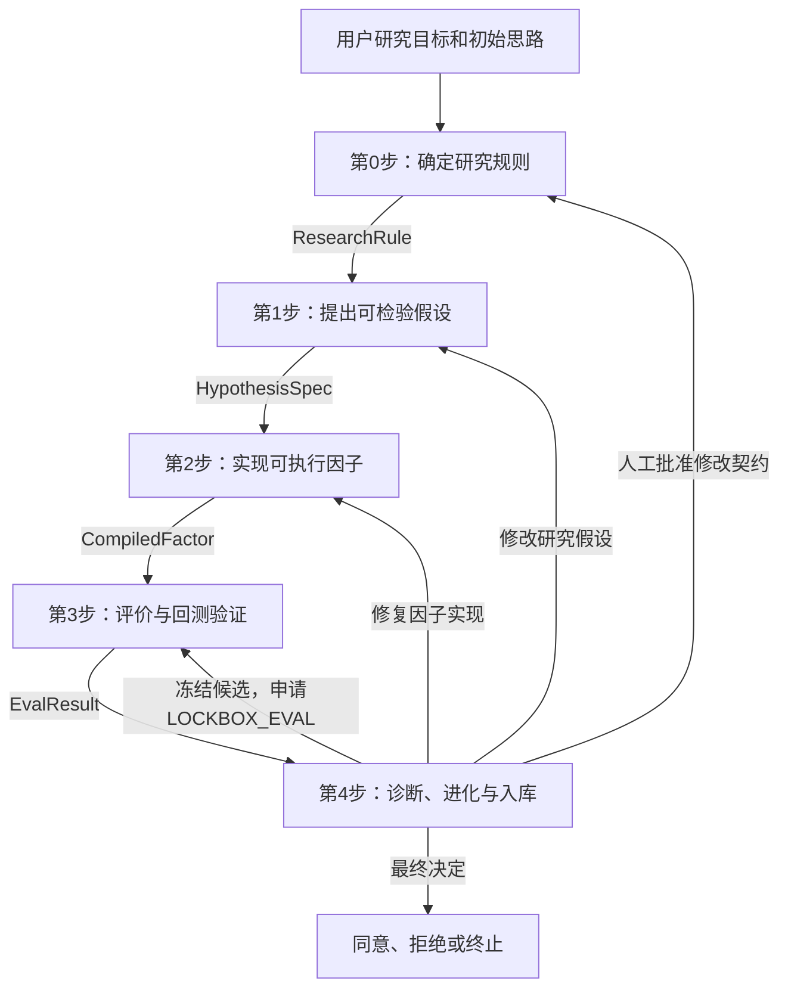

## 2.2 六层系统架构

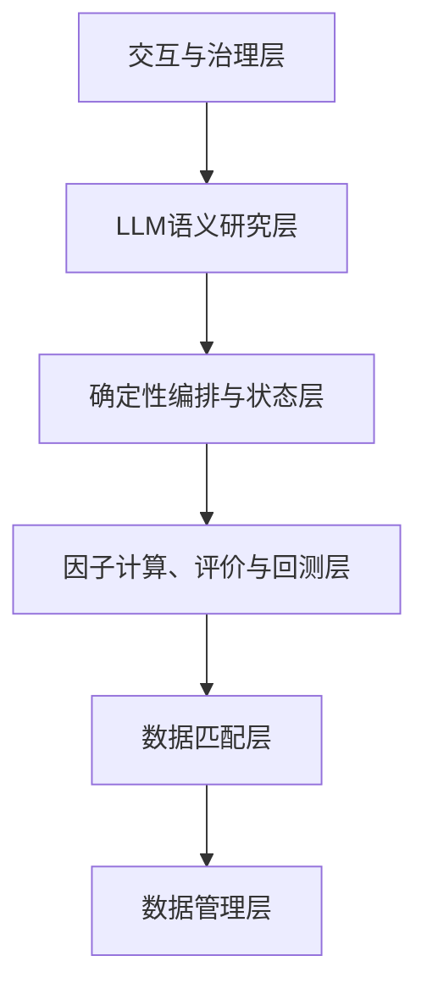

| 层级       | 组件                                                     | 主要职责          |
| -------- | ------------------------------------------------------ | ------------- |
| 交互与治理层   | 用户界面、人工审批、预算、报告                                        | 决定研究目标和最终是否接收 |
| LLM语义研究层 | 检索角色、Idea角色、批判角色、Factor角色、诊断角色                         | 处理自然语言和研究逻辑   |
| 编排与状态层   | Orchestrator、状态机、队列、重试、版本                              | 控制任务执行顺序      |
| 计算与回测层   | AST编译器、Python沙箱、Qlib评价、A股执行扩展                          | 产生确定性数值结果     |
| 数据匹配层    | MySQL Provider、FieldRegistry、PIT、Snapshot、Qlib Adapter | 保证数据口径和时间正确   |
| 数据管理库层   | MySQL、文献库、算子库、因子库、实验库、轨迹库                              | 保存可复现各种数据     |

## 2.3 横向研究

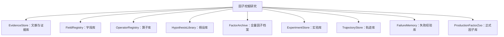

## 2.4 组件责任边界

| 组件           | 允许做什么                | 禁止做什么          |
| ------------ | -------------------- | -------------- |
| Retrieval角色  | 检索研报、论文和历史经验         | 编造未检索到的来源      |
| Idea角色       | 提出机制和证伪条件            | 计算回测结果         |
| Critic角色     | 检查经济逻辑和可检验性          | 修改ResearchRule |
| Factor角色     | 生成语义描述和FactorSpec    | 自由执行任意代码       |
| Diagnostic角色 | 解释结构化失败结果            | 查看最终锁箱后继续调参    |
| Orchestrator | 状态、预算、重试、版本、门控       | 自主提出金融结论       |
| Python服务     | 编译、算子、FactorFrame、测试 | 作为第二套正式回测框架    |
| Qlib         | 因子评价、模型、组合和回测        | 生成自然语言假设       |
| MySQL        | 原始数据和元数据真相           | 保存不受控的LLM思维过程  |

---

# 3. 统一接口

## 3.1 每一步必须使用同一种结构

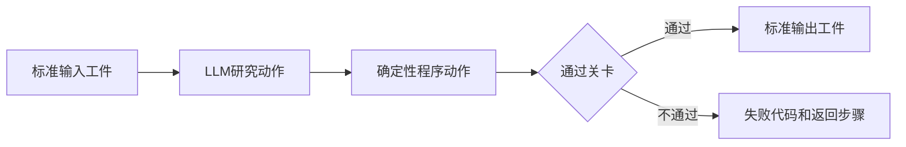

每一步都必须定义：

1. 输入工件；
2. LLM任务；
3. 确定性程序任务；
4. 通过条件；
5. 输出工件；
6. 失败错误代码；
7. 允许返回的步骤；
8. 必须保存的版本和血缘。

## 3.2 五步接口总表

| 步骤  | 输入               | 核心处理                           | 标准输出                                                  | 合法去向            |
| --- | ---------------- | ------------------------------ | ----------------------------------------------------- | --------------- |
| 第0步 | 用户目标、数据元数据       | 冻结规则、样本、时点和快照                  | `ResearchRule`、`SnapshotManifest`                     | 第1步；失败留在第0步     |
| 第1步 | 规则、证据、历史经验       | 检索、生成、批判和筛选可证伪假设               | `EvidenceBundle`、`HypothesisSpec`                     | 第2步；修订留在第1步     |
| 第2步 | 假设、字段库、算子库       | FactorSpec、AST、编译和测试           | `FactorSpec`、`CompiledFactor`、`FactorTestReport`      | 第3步；错误返回第0、1或2步 |
| 第3步 | 可执行因子或冻结候选、契约、快照 | `RESEARCH_EVAL`或`LOCKBOX_EVAL` | `EvalResult`                                          | 第4步，不直接返回第1或2步  |
| 第4步 | 评价结果、轨迹、预算       | 诊断、Mutation、Crossover、冻结和准入    | `DiagnosticReport`、`RevisionPlan`或`AdmissionDecision` | 第0、1、2、3步或停止    |

## 3.3 唯一合法的工件链

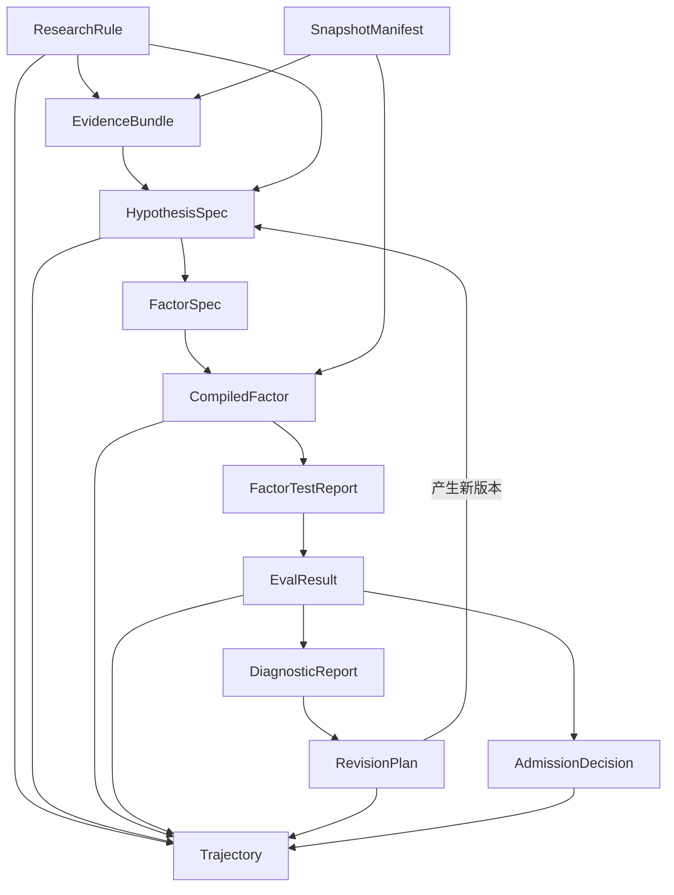

任何Agent不得跳过中间工件直接把自然语言结果传给下一步。

---

# 4. 标准研究工件

## 4.1 工件定义

| 工件                  | 作用        | 产生步骤 | 真正使用的步骤 |
| ------------------- | --------- | ---: | ------: |
| `ResearchRule`      | 冻结的研究制度   |    0 |     1—4 |
| `SnapshotManifest`  | 数据快照清单    |    0 |     1—3 |
| `EvidenceBundle`    | 支持假设的证据片段 |    1 |     1、4 |
| `HypothesisSpec`    | 可检验的研究假设  |    1 |     2、4 |
| `FactorSpec`        | 因子应该如何计算  |    2 |     2—4 |
| `CompiledFactor`    | 因子实际怎样执行  |    2 |       3 |
| `FactorTestReport`  | 实现正确性测试   |    2 |     3、4 |
| `EvalResult`        | 因子和策略评价   |    3 |       4 |
| `DiagnosticReport`  | 结构化失败诊断   |    4 |       4 |
| `RevisionPlan`      | 下一轮应修改什么  |    4 |   0、1或2 |
| `AdmissionDecision` | 接收、拒绝或停止  |    4 |  因子库、人工 |
| `Trajectory`        | 全过程有序记录   |  全流程 |    4、审计 |

## 4.2 所有工件共同字段

```text
project_id
run_id
parent_run_id
artifact_id
artifact_version
contract_id
snapshot_id
generation_id
phase
created_at
created_by
status
error_code
retry_count
```

计算类工件还必须保存：

```text
formula_hash
ast_hash
code_hash
operator_registry_version
field_registry_version
qlib_config_hash
random_seed
```

## 4.3 版本不可覆盖

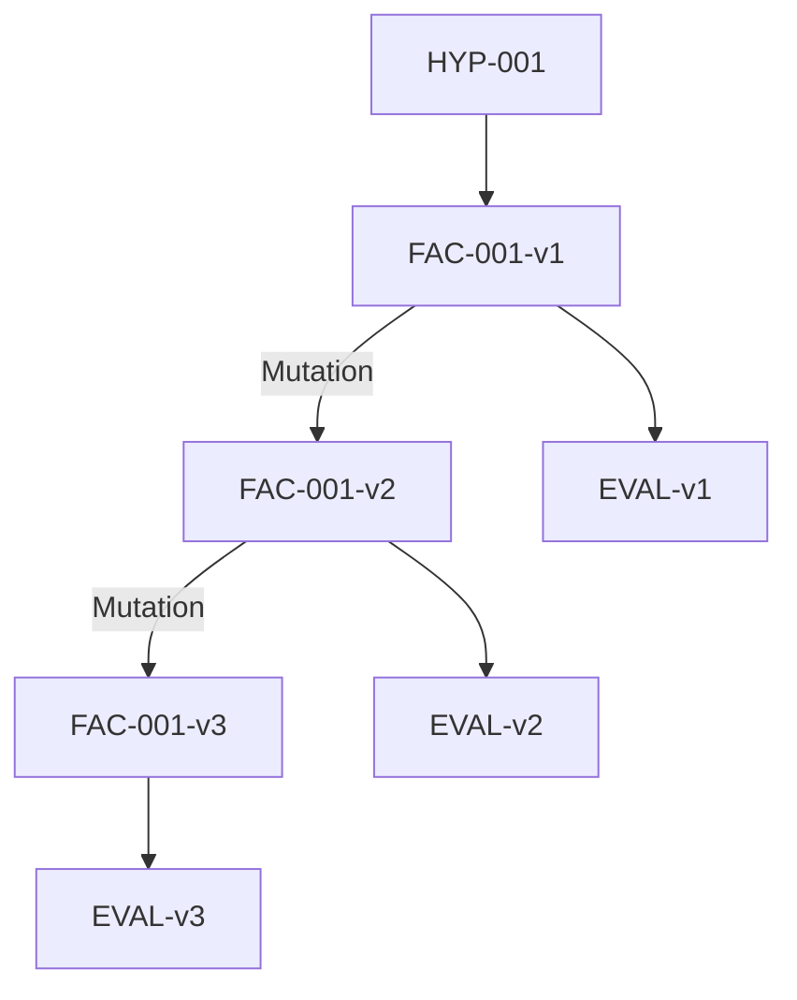

以下修改都必须创建新版本：

- 修改因子公式；
- 修改窗口或阈值；
- 修改缺失值规则；
- 修改中性化方式；
- 修改依赖的算子版本；
- 修复执行代码；
- 修改数据快照；
- 修改Qlib评价配置。

---

# 5. 全局状态机与错误路由

## 5.1 全局状态机

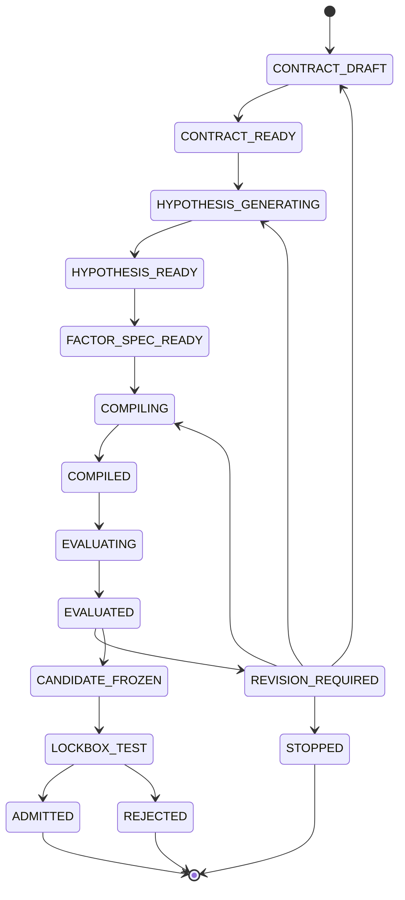

状态含义：

- `COMPILED`：实现正确，不代表因子有效；
- `EVALUATED`：评价完成，不代表通过；
- `CANDIDATE_FROZEN`：公式、代码、参数全部冻结；
- `LOCKBOX_TEST`：最终样本外只运行一次；
- `ADMITTED`：可以进入正式因子库；
- `REJECTED`：最终拒绝，不能根据锁箱继续修改；
- `STOPPED`：预算或研究条件不足而停止。

## 5.2 全局错误分类

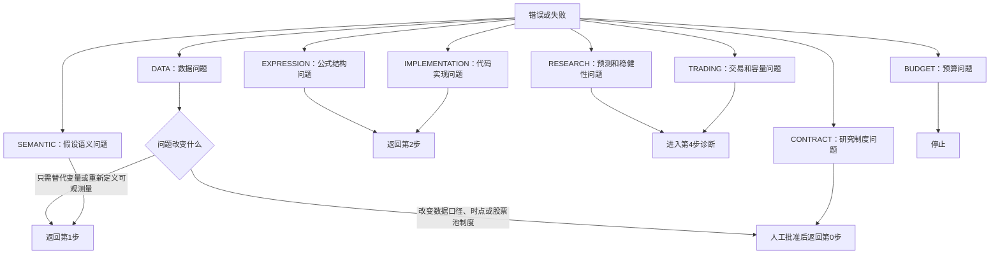

## 5.3 返回路径规则

| 发现的问题 | 返回位置 | 原因 |
|---|---|---|
| 代码或索引错误 | 第2步 | 不改变研究假设 |
| 公式偏离假设 | 第1步 | 必须重新定义研究语义 |
| 字段缺失但可替代 | 第1步 | 替代变量可能改变假设 |
| 标签、股票池或成交制度错误 | 第0步 | 研究制度需要人工批准 |
| IC弱或方向错误 | 第4步诊断后返回第1步 | 属于研究失败 |
| 换手高或成本高 | 第4步诊断后返回第1或2步 | 可能是机制或实现问题 |
| 锁箱失败 | 直接拒绝 | 锁箱不能进入迭代 |
| 预算耗尽 | 停止 | 防止无限搜索和过拟合 |

---

# 6. 第0步：确定研究规则

## 6.1 目标

第0步负责在查看因子结果之前，把股票池、数据、标签、交易、样本划分、统计门槛和搜索预算冻结为研究契约。

它回答：

> 我们究竟在什么数据上、按照什么规则、预测什么目标，并用什么方法判断成功？

## 6.2 完整流程

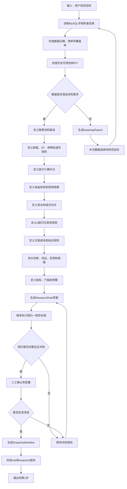

## 6.3 ResearchRule内容

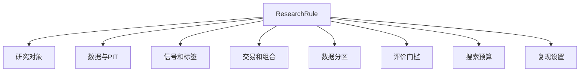

| 类别   | 字段                    |
| ---- | --------------------- |
| 研究对象 | 市场、股票池、基准、行业分类版本      |
| 股票过滤 | ST、新股、退市、停牌、异常股票      |
| 数据   | 表、字段、频率、复权、数据截止日      |
| PIT  | 公告日、成分股历史、行业历史、可用时间   |
| 信号   | 第`t`日何时计算因子           |
| 标签   | 从什么价格到什么价格、预测多少期      |
| 交易   | 第`t+1`日何时成交、调仓频率      |
| A股限制 | 涨跌停、一字板、停牌、整数手        |
| 组合   | TopK、分层、多空、等权或风险权重    |
| 成本   | 买入、卖出、印花税、滑点          |
| 分区   | 训练、验证、挖掘反馈、锁箱         |
| 指标   | IC、ICIR、回撤、换手、容量等     |
| 预算   | 假设数、表达式数、迭代数、Token、时间 |
| 复现   | 随机种子、Qlib配置、快照和库版本    |

## 6.4 建议的A股时点约定

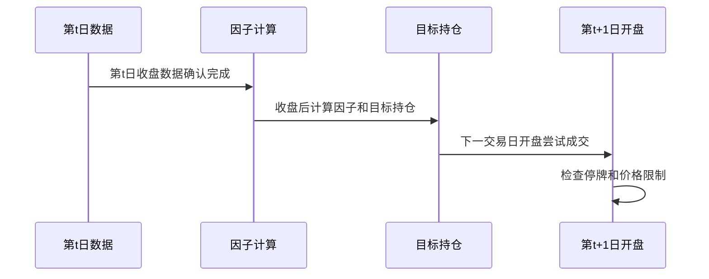

默认约定：

> 第`t`日收盘后计算因子，第`t+1`日开盘尝试交易。

如果因子使用第`t`日收盘数据，却假设在第`t`日收盘成交，将产生未来信息或不可实现成交。

## 6.5 数据分区

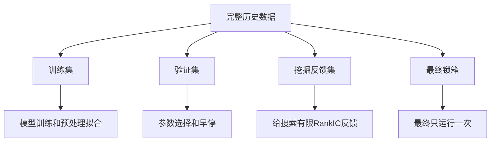

| 数据区间  | Agent是否可见 |  是否允许反馈迭代 |
| ----- | --------: | --------: |
| 训练集   |         是 |         是 |
| 验证集   |        有限 | 是，但受预算的约束 |
| 挖掘反馈集 |         是 |         是 |
| 最终锁箱  |         否 |         否 |

## 6.6 第0步输出

```text
ResearchRule.status = Rule_READY
SnapshotManifest.status = SNAPSHOT_READY
rule_id 已冻结
snapshot_id 已冻结
人工审批记录存在
```

第0步未完成时，第1步不得启动。

---

# 7. 第1步：提出可检验假设

## 7.1 目标

第1步把文献、研报、金融理论、市场现象和历史研究经验转化为可被数据证明或否定的结构化假设。

它回答：

> 为什么某种当前可观测现象可能预测未来收益？

第1步不生成最终代码，不计算IC，也不进行回测。

## 7.2 完整流程

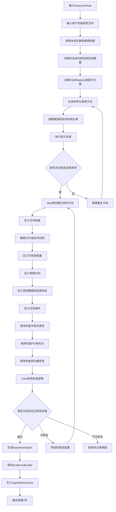

## 7.3 假设因果链


一个合格假设必须能回答：

1. 市场中观察到了什么；
2. 为什么该现象不会立即被价格完全反映；
3. 用哪些当时可得数据衡量；
4. 因子越大意味着什么；
5. 预测未来多长时间；
6. 在什么市场状态下可能有效；
7. 什么结果能够证明假设错误。

## 7.4 多样化研究方向-因子分类

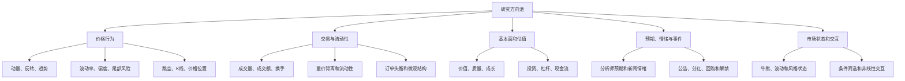

## 7.5 HypothesisSpec字段

| 字段                   | 说明           |
| -------------------- | ------------ |
| `hypothesis_id`      | 假设唯一编号       |
| `research_theme`     | 所属研究主题       |
| `market_phenomenon`  | 市场现象         |
| `mechanism`          | 经济或行为机制      |
| `expected_direction` | 因子与未来收益的预期方向 |
| `horizon`            | 预测期限         |
| `required_fields`    | 所需数据字段       |
| `parameter_ranges`   | 参数允许范围       |
| `universe`           | 适用股票池        |
| `regime`             | 适用市场状态       |
| `falsifier`          | 证伪条件         |
| `evidence_refs`      | 证据来源         |
| `risk_exposures`     | 可能混入的行业和风格暴露 |
| `novelty_summary`    | 与已有假设的差异     |
| `rule_id`            | 使用的研究规则      |
| `snapshot_id`        | 使用的数据快照      |

## 7.6 第1步门控机制

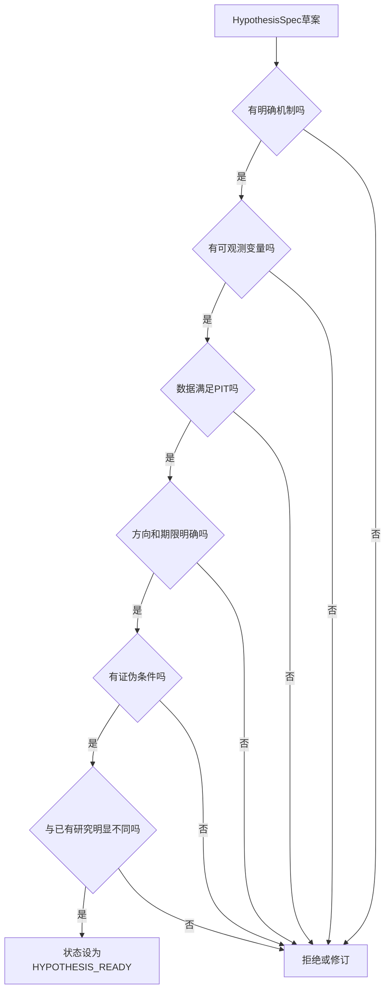

只有`HYPOTHESIS_READY`的假设可以进入第2步。

---

# 8. 第2步：实现可执行因子

## 8.1 目标

第2步把自然语言研究假设转换为结构化因子定义、AST和经过测试的可执行实现。

它回答：

> 这个因子究竟怎样计算，以及程序是否正确实现了原始假设？

第2步不计算IC，不运行正式组合回测，不决定因子是否有效。

## 8.2 完整流程

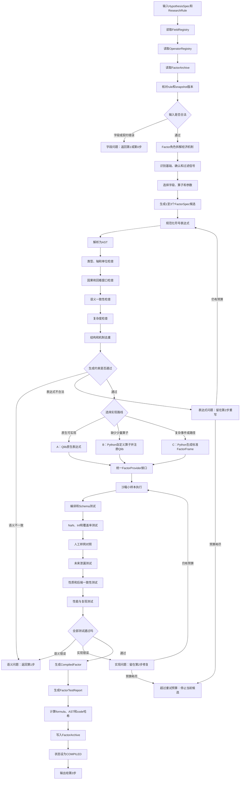

## 8.3 从假设到FactorSpec

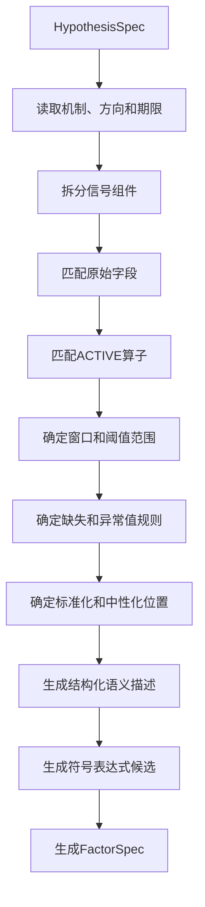

信号组件建议统一分为：

| 组件 | 含义 | 示例 |
|---|---|---|
| 基础信号 | 直接反映研究现象 | 5日收益率 |
| 确认信号 | 判断基础信号是否可靠 | 成交量放大 |
| 过滤条件 | 限定适用状态 | 低波动环境 |
| 标准化 | 使不同股票可比较 | 截面Rank |
| 中性化 | 剥离系统性暴露 | 行业、市值残差 |
| 组合方式 | 合并多个组件 | 加权、乘积、条件选择 |

## 8.4 FactorSpec字段

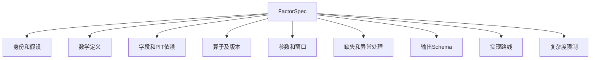

| 字段                      | 说明                                 |
| ----------------------- | ---------------------------------- |
| `factor_id`             | 因子永久身份                             |
| `factor_version_id`     | 当前版本                               |
| `hypothesis_id`         | 来源假设                               |
| `semantic_description`  | 公式各组成部分的经济含义                       |
| `symbolic_expression`   | 原始符号表达式                            |
| `canonical_expression`  | 规范化表达式                             |
| `required_fields`       | 字段和版本                              |
| `operator_dependencies` | 算子和版本                              |
| `parameters`            | 窗口和阈值                              |
| `warmup_days`           | 最少预热期                              |
| `nan_policy`            | 缺失值处理                              |
| `inf_policy`            | 无穷值处理                              |
| `winsorize_policy`      | 缩尾规则                               |
| `normalize_policy`      | 标准化规则                              |
| `neutralize_policy`     | 中性化规则或位置                           |
| `output_schema`         | 索引、列和类型                            |
| `implementation_route`  | A、B或C                              |
| `rule_id`               | 研究契约                               |
| `snapshot_id`           | 数据快照                               |
| `status`                | 通过字段、算子和语义检查后设为`FACTOR_SPEC_READY` |

## 8.5 算子库调用

```mermaid
flowchart TD
    A["FactorSpec需要算子"]
    B["查询OperatorRegistry"]
    C{"算子是否存在且ACTIVE"}

    D["读取OperatorSpec"]
    E["检查输入输出类型"]
    F["检查时间或截面轴"]
    G["检查参数范围"]
    H["检查因果性和lookback"]
    I["检查后端绑定"]
    J{"检查通过吗"}

    K["绑定operator_version"]
    L["记录Factor依赖"]
    M["进入AST构建"]

    N["提交OperatorRequest"]
    O["实现并测试新算子"]
    P{"算子审批通过吗"}
    Q["注册新版本"]
    R["拒绝本表达式"]

    A --> B --> C
    C -->|"是"| D --> E --> F --> G --> H --> I --> J
    C -->|"否"| N --> O --> P
    P -->|"是"| Q --> B
    P -->|"否"| R
    J -->|"是"| K --> L --> M
    J -->|"否"| R
```

每个算子必须定义：

```text
operator_id
operator_version
category
input_types
output_type
axis
causal
lookback_rule
parameter_schema
nan_policy
inf_policy
qlib_binding
python_binding
test_status
deprecated_status
```

## 8.6 AST生成和检查

```mermaid
flowchart TD
    A["符号表达式"]
    B["识别字段、参数和算子"]
    C["建立AST节点"]
    D["连接数据依赖"]
    E["生成规范化AST"]

    F["检查算子参数数量"]
    G["检查输入输出类型"]
    H["检查时间与截面轴"]
    I["检查单位和量纲"]
    J["计算总回看长度"]
    K["禁止未来引用"]
    L["计算节点数和深度"]
    M["生成ast_hash"]
    N{"AST是否合法"}

    O["保存ast_json"]
    P["进入约束门"]
    X["返回表达式生成"]

    A --> B --> C --> D --> E
    E --> F --> G --> H --> I --> J --> K --> L --> M --> N
    N -->|"是"| O --> P
    N -->|"否"| X
```

AST节点类型包括：

- 字段节点：`close`、`volume`、`revenue`；
- 参数节点：窗口5、窗口20、阈值0.7；
- 时间序列节点：`TS_MEAN`、`DELAY`；
- 截面节点：`RANK`、`ZSCORE`；
- 数学节点：`ADD`、`DIV`、`LOG`；
- 逻辑节点：`GT`、`AND`、`WHERE`。

## 8.7 三层生成约束

```mermaid
flowchart TD
    A["候选FactorSpec和AST"]

    B["语义一致性"]
    C["复杂度控制"]
    D["冗余性控制"]

    B1["假设与语义描述"]
    B2["语义描述与表达式"]
    B3["表达式与实现计划"]

    C1["字符长度"]
    C2["AST节点数和深度"]
    C3["字段数量"]
    C4["自由参数数量和比例"]

    D1["公式哈希"]
    D2["AST结构相似度"]
    D3["机制语义相似度"]
    D4["历史因子族比较"]

    E{"全部通过吗"}
    PASS["允许实现"]
    REWRITE["局部重写"]
    REJECT["拒绝并记录"]

    A --> B --> B1 --> B2 --> B3 --> E
    A --> C --> C1 --> C2 --> C3 --> C4 --> E
    A --> D --> D1 --> D2 --> D3 --> D4 --> E
    E -->|"是"| PASS
    E -->|"可修复"| REWRITE
    E -->|"预算耗尽"| REJECT
```


## 8.8 三种实现路线

```mermaid
flowchart TD
    A["通过约束的FactorSpec"]
    B{"Qlib能否原生表达"}
    C["路线A：Qlib表达式"]
    D{"是否只缺少少量算子"}
    E["路线B：Python自定义算子"]
    F["测试并注册到Qlib"]
    G["路线C：Python复杂FactorFrame"]
    H["统一FactorProvider接口"]
    I["进入测试"]

    A --> B
    B -->|"是"| C --> H
    B -->|"否"| D
    D -->|"是"| E --> F --> H
    D -->|"否"| G --> H
    H --> I
```

| 路线 | 适用场景 | 示例 |
|---|---|---|
| A：Qlib原生 | 简单滚动和截面表达式 | 动量、均线、波动率 |
| B：自定义算子 | 仅缺一个可复用操作 | 行业内条件Rank |
| C：FactorFrame | 复杂事件、路径、状态机 | 大涨—回撤—突破前高 |

路线C标准输出：

```text
index = [datetime, instrument]
column = factor_value
dtype = float
```

Python只负责因子实现；所有路线最终都进入Qlib统一评价。

## 8.9 测试体系

```mermaid
flowchart TD
    A["实现完成"]
    B["T0编译测试"]
    C["T1 Schema和索引"]
    D["T2 NaN、Inf和覆盖率"]
    E["T3人工样例对照"]
    F["T4未来泄漏测试"]
    G["T5截面顺序不变性"]
    H["T6尺度和单位性质"]
    I["T7后端一致性"]
    J["T8性能和资源"]
    K["T9确定性和复现"]
    L{"全部通过吗"}
    M["FactorTestReport=PASSED"]
    N["生成CompiledFactor"]
    X["分类失败并返回"]

    A --> B --> C --> D --> E --> F --> G --> H --> I --> J --> K --> L
    L -->|"是"| M --> N
    L -->|"否"| X
```

| 测试 | 检查内容 |
|---|---|
| 编译 | 表达式和代码是否可运行 |
| Schema | 是否为日期×股票索引、类型是否正确 |
| 数值 | NaN、Inf、覆盖率和极值 |
| 人工样例 | 小样本手工计算是否一致 |
| 因果 | 修改未来数据是否影响过去因子 |
| 顺序不变性 | 打乱股票顺序后截面结果是否一致 |
| 尺度性质 | 价格或成交量缩放后行为是否合理 |
| 后端一致性 | Qlib与Python参考实现是否一致 |
| 性能 | 时间、内存、缓存命中 |
| 复现 | 相同输入和版本是否得到相同输出 |

## 8.10 未来泄漏测试

```mermaid
flowchart TD
    A["计算原始小样本因子"]
    B["复制数据"]
    C["只修改未来日期的数据"]
    D["重新计算因子"]
    E["比较修改日期以前的结果"]
    F{"过去因子是否变化"}
    G["检测到LOOKAHEAD"]
    H["定位字段或算子并拒绝"]
    I["测试通过"]

    A --> B --> C --> D --> E --> F
    F -->|"是"| G --> H
    F -->|"否"| I
```

还必须禁止：

- 负数滞后；
- 使用未来收益作为输入；
- 使用财务报告期而非公告日；
- 使用最新行业分类回填历史；
- 使用当前指数成分回填历史；
- 使用全样本均值或标准差预处理过去数据。

## 8.11 因子档案写入

```mermaid
flowchart TD
    A["测试通过"]
    B["生成CompiledFactor"]
    C["计算formula、AST和code哈希"]
    D["查询FactorArchive"]
    E{"完全相同版本是否存在"}
    F["创建FactorVersion"]
    G["记录假设、字段和算子依赖"]
    H["关联测试报告"]
    I["状态设为COMPILED"]
    J["写入Trajectory"]
    K["输出给第3步"]
    X["引用已有版本并记录重复事件"]

    A --> B --> C --> D --> E
    E -->|"否"| F --> G --> H --> I --> J --> K
    E -->|"是"| X
```

## 8.12 CompiledFactor字段

| 字段                              | 说明           |
| ------------------------------- | ------------ |
| `factor_id`、`factor_version_id` | 因子身份和版本      |
| `hypothesis_id`                 | 来源假设         |
| `factor_spec`                   | 完整FactorSpec |
| `canonical_expression`          | 规范化表达式       |
| `ast_json`、`ast_hash`           | AST和结构哈希     |
| `implementation_route`          | A、B或C        |
| `qlib_expression`               | Qlib表达式，可为空  |
| `python_module`                 | Python模块，可为空 |
| `operator_dependencies`         | 算子版本         |
| `field_dependencies`            | 字段版本         |
| `warmup_days`                   | 预热长度         |
| `formula_hash`、`code_hash`      | 公式和代码哈希      |
| `test_report_id`                | 测试报告         |
| `rule_id`、`snapshot_id`         | 规则和快照        |
| `status`                        | `COMPILED`   |

## 8.13 第2步错误返回

| 错误代码 | 处理 |
|---|---|
| `DATA_FIELD_MISSING` | 第1步寻找替代变量 |
| `DATA_NOT_PIT` | 第1步或人工批准返回第0步 |
| `CONTRACT_CONFLICT` | 第0步 |
| `OPERATOR_NOT_FOUND` | 第2步开发新算子 |
| `TYPE_MISMATCH` | 第2步重写表达式 |
| `AXIS_MISMATCH` | 第2步重写表达式 |
| `UNIT_MISMATCH` | 第2步重写表达式 |
| `LOOKAHEAD_DETECTED` | 第2步修复或拒绝 |
| `SEMANTIC_MISMATCH` | 第1步 |
| `COMPLEXITY_EXCEEDED` | 第2步简化 |
| `STRUCTURAL_DUPLICATE` | 第2步重写或停止 |
| `COMPILE_FAILED` | 第2步修代码 |
| `SCHEMA_INVALID` | 第2步修代码 |
| `BACKEND_MISMATCH` | 第2步修适配器 |
| `PERFORMANCE_EXCEEDED` | 第2步优化实现 |
| `RETRY_EXHAUSTED` | 停止当前候选 |

第2步输出条件：

```text
CompiledFactor.status == COMPILED
FactorTestReport.status == PASSED
rule_id与当前规则一致
snapshot_id与当前快照一致
所有依赖版本已冻结
```

---

# 9. 第3步：评价与回测验证

## 9.1 目标

第3步使用固定数据、固定契约和固定Qlib配置，对已经正确实现的因子进行预测能力、稳健性、组合收益、风险和可交易性评价。

它回答两个不同问题：

1. 因子是否能够预测未来收益；
2. 因子在真实交易约束下是否能够形成可交易收益。

因子评价与策略回测不能混为一谈。IC较高不等于策略必然赚钱；策略赚钱也可能来自行业、市值或市场贝塔。

## 9.2 两种评价模式

```mermaid
flowchart TD
    A["第3步评价请求"]
    B{"evaluation_mode"}
    C["RESEARCH_EVAL"]
    D["LOCKBOX_EVAL"]

    C1["研究、验证和反馈数据"]
    C2["结果允许进入第4步诊断"]

    D1["仅冻结候选可以申请"]
    D2["最终锁箱只运行一次"]
    D3["结果只能接收或拒绝"]

    A --> B
    B --> C --> C1 --> C2
    B --> D --> D1 --> D2 --> D3
```

规则：

- 普通候选先运行`RESEARCH_EVAL`；
- 第4步确认候选完全冻结后，才能申请`LOCKBOX_EVAL`；
- 锁箱结果不得用于Mutation、Crossover或参数选择；
- 锁箱失败直接`REJECTED`。

## 9.3 研究评价完整流程

```mermaid
flowchart TD
    A["输入CompiledFactor"]
    B["输入ResearchRule和Snapshot"]
    C["核对公式、代码、算子和Qlib配置哈希"]
    D{"G0合法性检查"}

    E["G1数据质量"]
    F["覆盖率、缺失、极值和分布"]
    G{"数据质量合格吗"}

    H["G2预测能力"]
    I["计算IC、RankIC和ICIR"]
    J["计算IC方向比例"]
    K["分层收益和多空收益"]
    L{"预测能力合格吗"}

    M["G3稳健性和纯Alpha"]
    N["行业和市值中性化"]
    O["分年份、行业、市值和状态"]
    P["Bootstrap和多重检验"]
    Q{"稳健性合格吗"}

    R["G4组合和可交易性"]
    S["生成预测分数和目标持仓"]
    T["应用A股成交规则"]
    U["Qlib统一回测"]
    V["成本、换手、回撤和容量"]
    W{"成本后可交易吗"}

    Y["G5验证集和压力测试"]
    Z["成本、阈值和市场状态敏感性"]
    Z2{"验证阶段通过吗"}

    PASS["输出RESEARCH_PASS的EvalResult"]
    FAIL["输出RESEARCH_FAIL的EvalResult"]
    STEP4["进入第4步诊断"]

    A --> B --> C --> D
    D -->|"否"| FAIL
    D -->|"是"| E --> F --> G
    G -->|"否"| FAIL
    G -->|"是"| H --> I --> J --> K --> L
    L -->|"否"| FAIL
    L -->|"是"| M --> N --> O --> P --> Q
    Q -->|"否"| FAIL
    Q -->|"是"| R --> S --> T --> U --> V --> W
    W -->|"否"| FAIL
    W -->|"是"| Y --> Z --> Z2
    Z2 -->|"是"| PASS --> STEP4
    Z2 -->|"否"| FAIL --> STEP4
```

## 9.4 G0：合法性检查

G0不重新实现因子，而是核对第2步输出能否在当前实验中使用。

| 检查                                  | 失败代码                        |
| ----------------------------------- | --------------------------- |
| `CompiledFactor.status == COMPILED` | `FACTOR_NOT_COMPILED`       |
| FactorTestReport通过                  | `FACTOR_TEST_NOT_PASSED`    |
| rule一致                              | `RULE_VERSION_MISMATCH`     |
| snapshot一致                          | `SNAPSHOT_VERSION_MISMATCH` |
| operator版本存在                        | `OPERATOR_VERSION_MISSING`  |
| code hash一致                         | `CODE_HASH_MISMATCH`        |
| Qlib配置冻结                            | `QLIB_CONFIG_NOT_FROZEN`    |
| 锁箱模式权限正确                            | `LOCKBOX_ACCESS_DENIED`     |

## 9.5 G1：数据质量

```mermaid
flowchart TD
    A["因子值FactorPanel"]
    B["每日覆盖率"]
    C["连续缺失区间"]
    D["NaN和Inf比例"]
    E["截面分布和极值"]
    F["时间稳定性"]
    G["行业和市值覆盖"]
    H{"是否达到契约门槛"}
    I["进入预测评价"]
    J["返回数据质量失败"]

    A --> B --> C --> D --> E --> F --> G --> H
    H -->|"是"| I
    H -->|"否"| J
```

建议保存而不是只保存一个总体覆盖率：

- 每日有效股票数；
- 每日覆盖率；
- 按年份覆盖率；
- 按行业覆盖率；
- 按市值组覆盖率；
- 新股、停牌和ST导致的缺失；
- 最长连续缺失长度；
- 有效截面不足的日期数量。

## 9.6 G2：预测能力

### IC

对每个交易日计算：

$$
IC_t
=
Corr_{CS}(f_{i,t},r_{i,t\rightarrow t+h})
$$

然后：

$$
\overline{IC}
=
\frac{1}{T}\sum_{t=1}^{T}IC_t
$$

### RankIC

$$
RankIC_t
=
Corr_{CS}
\left(
Rank(f_{i,t}),
Rank(r_{i,t\rightarrow t+h})
\right)
$$

### ICIR

$$
ICIR
=
\frac{\operatorname{mean}(IC_t)}
{\operatorname{std}(IC_t)}
\sqrt{A}
$$

其中`A`为年化频率。必须在契约中明确日频、周频或月频，避免不同研究使用不同年化方式。

## 9.7 预测指标体系

| 指标 | 作用 |
|---|---|
| Mean IC | 平均线性预测能力 |
| Mean RankIC | 平均单调预测能力 |
| ICIR | IC的稳定性 |
| IC正向比例 | 方向一致的日期比例 |
| IC t值 | 均值相对不确定性 |
| 分组收益 | 检查单调性 |
| Top-Bottom收益 | 检查极端组差异 |
| 覆盖率 | 指标的有效样本基础 |

所有指标必须同时保存：

- 分子；
- 分母；
- 有效日期数；
- 每日截面股票数；
- 缺失处理方法；
- 标签定义；
- 是否中性化。

## 9.8 G3：稳健性与纯Alpha

```mermaid
flowchart TD
    A["原始因子评价"]
    B["行业中性化"]
    C["市值中性化"]
    D["行业和市值联合中性化"]
    E["分年份"]
    F["分行业"]
    G["分市值"]
    H["分牛熊和波动状态"]
    I["Bootstrap置信区间"]
    J["多重检验修正"]
    K{"是否稳定且非偶然"}
    PASS["进入组合回测"]
    FAIL["返回稳健性失败"]

    A --> B --> C --> D --> E --> F --> G --> H --> I --> J --> K
    K -->|"是"| PASS
    K -->|"否"| FAIL
```

中性化回归示例：

$$
f_{i,t}
=
\alpha_t
+\beta_{1,t}\log(MV_{i,t})
+\sum_k\gamma_{k,t}Industry_{i,k,t}
+\epsilon_{i,t}
$$

使用残差：

$$
f^{neutral}_{i,t}=\epsilon_{i,t}
$$

评价时应同时报告：

- 原始IC；
- 行业中性IC；
- 市值中性IC；
- 行业和市值联合中性IC。

如果原始IC较高但联合中性IC接近0，应标记`STYLE_EXPOSURE_DOMINATED`，不能直接视为纯Alpha。

## 9.9 多重检验

Agent会生成大量候选。即使所有因子都无效，也可能偶然出现高IC。

需要记录：

```text
本轮候选数量
累计候选数量
累计回测数量
选择过的参数组合数量
查看过的反馈集次数
```

建议至少使用：

- Bootstrap置信区间；
- FDR或其他多重假设修正；
- Deflated Sharpe Ratio；
- 时间序列稳定性；
- 与已有因子的边际预测贡献。

不能把单次高RankIC直接当作入池依据。

## 9.10 G4：Qlib组合评价

```mermaid
flowchart TD
    A["因子值"]
    B["按日期生成预测分数"]
    C["应用股票池和过滤规则"]
    D["生成目标持仓"]
    E["Strategy生成订单"]
    F["Executor推进交易日"]
    G["Exchange检查成交条件"]
    H["更新持仓、现金和净值"]
    I["Recorder保存结果"]
    J["生成策略指标"]

    A --> B --> C --> D --> E --> F --> G --> H --> I --> J
```

Qlib职责：

- 因子值加载；
- 标签与预测数据对齐；
- 单因子或模型预测；
- 策略构造；
- 执行和交易记录；
- 收益、风险和持仓结果；
- Recorder实验记录。

Python扩展职责：

- MySQL到Qlib的Provider；
- 自定义因子算子；
- 事件和路径FactorFrame；
- A股Strategy、Executor或Exchange规则扩展。

## 9.11 A股执行流程

```mermaid
flowchart TD
    A["第t日收盘后形成信号"]
    B["生成第t+1日目标持仓"]
    C["第t+1日开盘读取交易状态"]
    D{"股票是否停牌"}
    E{"订单方向"}
    F{"买单是否可买"}
    G{"卖单是否可卖"}
    H["拒绝订单并保留原持仓或现金"]
    I["按开盘成交模型执行"]
    J["不补选其他股票"]
    K["剩余可交易目标等权"]
    L["应用整数手和资金约束"]
    M["扣除佣金、印花税和滑点"]
    N["更新持仓和净值"]
    O["记录订单拒绝原因"]

    A --> B --> C --> D
    D -->|"是"| H
    D -->|"否"| E
    E -->|"买入"| F
    E -->|"卖出"| G
    F -->|"不可买"| H
    F -->|"可买"| I
    G -->|"不可卖"| H
    G -->|"可卖"| I
    H --> J
    I --> J
    J --> K --> L --> M --> N --> O
```

A股规则必须明确：

| 规则    | 要求            |
| ----- | ------------- |
| 停牌    | 买卖均不可成交       |
| 一字涨停  | 买单通常不可成交      |
| 一字跌停  | 卖单通常不可成交      |
| 普通涨跌停 | 按价格和成交模型判断    |
| 不补选   | 买不进时不临时寻找新股票  |
| 权重    | 剩余可买目标等权      |
| 原持仓   | 卖不出时继续保留      |
| 整数手   | A股买入数量符合交易单位  |
| 成本    | 买卖成本分开设置      |
| 退市    | 使用历史可知信息和预先规则 |

不能简单“剔除所有涨跌停股票”，必须结合订单方向判断。

## 9.12 策略指标

| 类别 | 指标 |
|---|---|
| 收益 | 年化收益、年化超额、累计收益 |
| 风险 | 波动率、最大回撤、下行风险 |
| 风险调整 | Sharpe、IR、Calmar |
| 交易 | 换手率、成交率、拒单率 |
| 成本 | 成本前后收益差、成本占毛收益比例 |
| 容量 | 成交额占比、冲击成本压力 |
| 持仓 | 股票数、行业偏离、市值偏离 |
| 稳定性 | 分年份收益、滚动指标 |

## 9.13 单因子评价与因子组合模型

```mermaid
flowchart TD
    A["单个CompiledFactor"]
    B["单因子IC和分层"]
    C["单因子策略回测"]
    D["研究评价"]

    E["多个已通过研究评价的因子"]
    F["去重和特征选择"]
    G["可选LightGBM或线性组合"]
    H["组合模型回测"]

    A --> B --> C --> D
    E --> F --> G --> H
```

规则：

- 单因子必须先独立评价；
- 不允许用组合模型掩盖单因子无效；
- LightGBM等组合模型只能使用已通过相应阶段的因子；
- 组合模型训练、验证和锁箱必须遵守相同数据分区；
- 单因子结果与组合边际贡献分别保存。

## 9.14 EvalResult结构

```mermaid
flowchart TD
    ER["EvalResult"]
    A["运行身份"]
    B["数据质量"]
    C["预测能力"]
    D["中性化和稳健性"]
    E["回测收益和风险"]
    F["交易性和容量"]
    G["门控结果"]
    H["证据和文件指针"]

    ER --> A
    ER --> B
    ER --> C
    ER --> D
    ER --> E
    ER --> F
    ER --> G
    ER --> H
```

必须字段：

```text
eval_result_id
evaluation_mode
factor_version_id
rule_id
snapshot_id
qlib_experiment_id
qlib_config_hash
effective_dates
effective_stock_count
coverage_metrics
ic_metrics
neutralized_ic_metrics
robustness_metrics
backtest_metrics
trading_metrics
capacity_metrics
gate_results
failed_gate
error_code
status
```

## 9.15 锁箱流程

```mermaid
flowchart TD
    A["第4步提交冻结候选"]
    B["验证公式、代码和参数未变化"]
    C["验证锁箱从未打开"]
    D["人工批准"]
    E{"批准打开吗"}
    F["LOCKBOX_EVAL只运行一次"]
    G{"最终门槛通过吗"}
    H["FINAL_PASS"]
    I["FINAL_FAIL"]
    J["返回第4步生成接收决定"]
    K["返回第4步生成拒绝决定"]

    A --> B --> C --> D --> E
    E -->|"否"| K
    E -->|"是"| F --> G
    G -->|"是"| H --> J
    G -->|"否"| I --> K
```

锁箱失败后禁止：

- 改参数再测；
- 改窗口再测；
- 改公式再测；
- 根据锁箱年份解释后增加条件；
- 把锁箱区间改名为验证集。

如果希望继续研究，必须创建新项目批次和新的未来锁箱制度。

---

# 10. 第4步：诊断、进化与因子入池

## 10.1 目标

第4步读取结构化评价结果和完整研究轨迹，定位失败发生在哪个环节，再选择：

- 修复实现；
- 修改假设；
- 执行Mutation；
- 执行Crossover；
- 冻结候选并申请锁箱；
- 接收入池；
- 拒绝或停止。

它不重新计算评价指标，也不能覆盖历史版本。

## 10.2 完整流程

```mermaid
flowchart TD
    A["输入EvalResult和Trajectory"]
    B["读取failed_gate和error_code"]
    C["提取成功与失败片段"]
    D["LLM生成DiagnosticReport"]
    E["程序核对诊断与数值证据"]
    F{"当前结果类型"}

    G["实现错误"]
    H["假设或机制错误"]
    I["研究有效但可局部改进"]
    J["多条高质量轨迹互补"]
    K["研究评价通过"]
    L["最终锁箱结果"]

    M["ImplementationRepairPlan"]
    N["HypothesisRevisionPlan"]
    O["MutationPlan"]
    P["CrossoverPlan"]
    Q["冻结候选"]
    R{"锁箱结果"}

    S["检查新颖性和剩余预算"]
    T{"允许继续吗"}
    U["创建子轨迹和新版本"]
    V["返回第2步"]
    W["返回第1步"]
    X["申请第3步LOCKBOX_EVAL"]
    Y["生成ADMITTED"]
    Z["生成REJECTED"]
    STOP["生成STOPPED"]

    A --> B --> C --> D --> E --> F
    F -->|"实现错误"| G --> M --> S
    F -->|"机制错误"| H --> N --> S
    F -->|"局部改进"| I --> O --> S
    F -->|"轨迹互补"| J --> P --> S
    F -->|"研究通过"| K --> Q --> X
    F -->|"锁箱结果"| L --> R

    S --> T
    T -->|"否"| STOP
    T -->|"是"| U
    U -->|"修复实现"| V
    U -->|"修改机制"| W

    R -->|"FINAL_PASS"| Y
    R -->|"FINAL_FAIL"| Z
```

## 10.3 诊断分类

| 失败表现         | 可能根因      | 返回步骤            |
| ------------ | --------- | --------------- |
| 编译或索引失败      | 实现错误      | 第2步             |
| 因果测试失败       | 算子或代码错误   | 第2步             |
| 公式和假设不一致     | 语义漂移      | 第1步             |
| IC方向相反       | 假设方向错误    | 第1步             |
| IC弱但方向稳定     | 信号过弱或变量不佳 | 第1步Mutation     |
| 原始IC高，中性化后消失 | 风格暴露      | 第1步             |
| IC较好但换手过高    | 时间尺度或平滑问题 | 第1或2步           |
| 成本后收益消失      | 交易性不足     | 第1步或停止          |
| 仅个别年份有效      | 市场状态依赖    | 第1步Mutation     |
| 与已有因子高度相关    | 因子拥挤      | Crossover、改写或拒绝 |
| 数据制度错误       | 规则问题      | 人工批准后第0步        |

## 10.4 轨迹级Mutation

Mutation不是随机改变公式，而是定位最可能导致失败的节点，仅修改局部。

```mermaid
flowchart TD
    A["选择一条待改进轨迹"]
    B["读取终端奖励和失败指标"]
    C["定位最可能出错节点"]
    D{"错误位置"}

    E["假设机制"]
    F["参数和时间尺度"]
    G["表达式和AST"]
    H["代码实现"]
    I["组合和交易设置"]

    J["冻结错误节点之前的轨迹前缀"]
    K["只改写目标节点"]
    L["重新生成受影响的后续工件"]
    M["检查新旧语义一致性"]
    N["建立parent-child血缘"]
    O["返回对应步骤"]

    A --> B --> C --> D
    D --> E --> J
    D --> F --> J
    D --> G --> J
    D --> H --> J
    D --> I --> J
    J --> K --> L --> M --> N --> O
```

Mutation动作示例：

| 问题 | 合法Mutation |
|---|---|
| 信号噪声高 | 平滑、缩短或延长窗口 |
| 方向正确但不稳定 | 增加确认信号 |
| 牛市有效熊市失效 | 加入预先定义的状态条件 |
| 换手率过高 | 平滑、延长持有期或使用迟滞 |
| 风格暴露严重 | 修改机制或中性化设计 |
| 代码错误 | 只改代码，不改变FactorSpec |

## 10.5 轨迹级Crossover

Crossover发生在研究逻辑层，不是简单把两个公式相乘。

```mermaid
flowchart TD
    A["高质量轨迹池"]
    B["选择父轨迹A"]
    C["选择父轨迹B"]
    D["提取各自有效机制"]
    E{"机制是否互补"}
    F["检查期限、字段和PIT兼容性"]
    G["形成新的组合假设"]
    H["重新生成HypothesisSpec"]
    I["重新生成FactorSpec"]
    J["执行复杂度和冗余检查"]
    K{"是否通过"}
    L["建立Crossover子轨迹"]
    M["返回第2步实现"]
    X["放弃本次配对"]

    A --> B
    A --> C
    B --> D
    C --> D
    D --> E
    E -->|"否"| X
    E -->|"是"| F --> G --> H --> I --> J --> K
    K -->|"是"| L --> M
    K -->|"否"| X
```

例如：

- 父轨迹A：短期价格动量；
- 父轨迹B：机构成交量确认；
- 子假设：只有得到持续成交支持的动量才可能延续。

必须先产生新的`HypothesisSpec`，再重新生成公式。禁止直接默认：

$$
Factor_C=Factor_A\times Factor_B
$$

## 10.6 搜索预算

```mermaid
flowchart TD
    A["准备新一轮迭代"]
    B{"超过最大假设数吗"}
    C{"超过单假设修改次数吗"}
    D{"连续多轮无改进吗"}
    E{"与历史因子高度重复吗"}
    F{"仍有Token、时间和回测预算吗"}
    G["允许创建新版本"]
    H["记录parent和generation"]
    I["执行返回路径"]
    STOP["停止并保存最佳历史版本"]

    A --> B
    B -->|"是"| STOP
    B -->|"否"| C
    C -->|"是"| STOP
    C -->|"否"| D
    D -->|"是"| STOP
    D -->|"否"| E
    E -->|"是"| STOP
    E -->|"否"| F
    F -->|"否"| STOP
    F -->|"是"| G --> H --> I
```

MVP建议：

| 预算 | 初始建议 |
|---|---:|
| 单批次研究方向 | 5—10 |
| 每方向初始假设 | 1—3 |
| 每假设表达式 | 1—3 |
| 单因子实现修复 | ≤3 |
| 单假设Mutation | ≤3 |
| 连续无改进 | ≤5 |
| 完整进化循环 | 先设3—5 |
| 锁箱运行 | 1次 |

为避免论文、研报和程序日志中的“轮数”含义不同，项目禁止单独使用`round`。统一记录：

- `generation_id`：同一批候选的代际；
- `cycle_id`：一次“生成—评价—反馈”的完整循环；
- `phase`：初始化、Mutation、Crossover或锁箱；
- `cumulative_eval_count`：截至当前实际评价过的因子版本数。

预算值应配置化，并记录：

```text
generation_id
cycle_id
phase
hypothesis_count
expression_count
compiled_count
evaluated_count
admitted_count
cumulative_eval_count
token_usage
compute_time
```

## 10.7 因子入池流程

```mermaid
flowchart TD
    A["全部研究评价候选"]
    B["排除数据和实现不合格因子"]
    C["按预注册综合评分排序"]
    D["检查公式和AST结构重复"]
    E{"结构是否重复"}
    F["检查因子值相关性"]
    G{"相关性是否低于阈值"}
    H["检查中性化IC和稳健性"]
    I{"统计门槛是否通过"}
    J["检查成本、换手和容量"]
    K{"交易门槛是否通过"}
    L["加入CandidatePool"]
    M["冻结公式、代码和参数"]
    N["申请最终锁箱"]
    O{"锁箱通过吗"}
    P["加入ProductionFactorZoo"]
    X["拒绝并记录原因"]

    A --> B --> C --> D --> E
    E -->|"是"| X
    E -->|"否"| F --> G
    G -->|"否"| X
    G -->|"是"| H --> I
    I -->|"否"| X
    I -->|"是"| J --> K
    K -->|"否"| X
    K -->|"是"| L --> M --> N --> O
    O -->|"是"| P
    O -->|"否"| X
```

相关性门槛必须在第0步预注册。可将QuantaAlpha使用的`|corr| < 0.7`作为MVP初始参考，但正式项目应分别配置：

- 与`ProductionFactorZoo`的最大相关系数；
- 与同机制因子的最大相关系数；
- 原始值相关性和行业、市值中性化后的残差相关性；
- 全样本、年份和市场状态子样本相关性。

任何阈值调整都会产生新的`contract_version`，不能在看到候选结果后静默修改。

## 10.8 因子池准入标准

不能只按RankIC入池。建议使用硬门槛加排序分数。

硬门槛：

- 第2步全部实现测试通过；
- 研究集和验证集满足最低预测门槛；
- 中性化后仍有预测能力；
- 多重检验后仍可接受；
- 与池内因子结构和数值不高度重复；
- 成本后仍有交易价值；
- 容量和成交率满足要求；
- 最终锁箱通过。

排序分数可写为：

$$
Score(f)
=
w_1Predictive
+w_2Stability
+w_3Tradability
-w_4Complexity
-w_5Redundancy
$$

但排序分数不能代替硬门槛。

## 10.9 AdmissionDecision

| 字段                      | 说明                              |
| ----------------------- | ------------------------------- |
| `decision_id`           | 决定编号                            |
| `factor_version_id`     | 因子版本                            |
| `decision`              | `ADMITTED`、`REJECTED`或`STOPPED` |
| `research_gate_summary` | 研究门控结果                          |
| `lockbox_result_id`     | 最终锁箱结果                          |
| `correlation_cluster`   | 因子簇                             |
| `capacity_assessment`   | 容量结论                            |
| `human_approval`        | 人工审批                            |
| `decision_reason`       | 结构化原因                           |
| `created_at`            | 决定时间                            |

## 10.10 第4步记忆写入

第4步只保存结构化经验，不保存或暴露隐藏思维链。

```mermaid
flowchart TD
    A["本轮研究结果"]
    B["成功模式"]
    C["失败约束"]
    D["高相关拥挤区域"]
    E["修复模式"]
    F["状态依赖模式"]

    G["TrajectoryStore"]
    H["FailureMemory"]
    I["FactorArchive"]
    J["HypothesisLibrary"]

    A --> B --> G
    A --> C --> H
    A --> D --> I
    A --> E --> G
    A --> F --> J
```

结构化经验示例：

```text
在当前rule和snapshot下，
20日以上窗口的同类量价背离表达式高度相关；
行业中性化后预测能力明显降低；
主要失败原因是市值暴露；
后续同类假设必须预先控制size exposure。
```

---

# 11. 数据、字段与PIT系统

## 11.1 数据原则

MySQL是原始数据唯一事实源。Qlib数据、Parquet、HDF5、缓存和FactorFrame均为可重新生成的适配产物或计算缓存。

```mermaid
flowchart TD
    MYSQL["MySQL唯一事实源"]
    META["Schema和FieldRegistry"]
    PIT["PIT对齐服务"]
    SNAP["SnapshotBuilder"]
    QPROVIDER["Qlib Data Provider"]
    CACHE["Parquet或HDF5计算缓存"]
    FACTOR["FactorFrame"]

    MYSQL --> META
    MYSQL --> PIT --> SNAP
    SNAP --> QPROVIDER
    SNAP --> CACHE
    QPROVIDER --> FACTOR
    CACHE --> FACTOR
```

禁止：

- 同一研究同时从MySQL和外部行情源拼接同名字段；
- 手工修改Qlib缓存后不更新快照；
- 把预计算HDF5视为独立事实源；
- 使用最新财务值回填历史；
- 直接覆盖原始MySQL研究表。

## 11.2 FieldRegistry

```mermaid
flowchart TD
    FR["FieldRegistry"]
    A["身份和来源"]
    B["数据类型和单位"]
    C["时间与频率"]
    D["PIT和可得性"]
    E["质量和覆盖率"]
    F["Qlib映射"]
    G["权限和版本"]

    FR --> A
    FR --> B
    FR --> C
    FR --> D
    FR --> E
    FR --> F
    FR --> G
```

| 字段 | 示例 |
|---|---|
| `field_id` | `FIELD_DAILY_CLOSE` |
| `canonical_name` | `close` |
| `source_table` | `daily_quote` |
| `source_column` | `close_price` |
| `data_type` | `FLOAT` |
| `semantic_type` | `PRICE` |
| `unit` | `CNY_PER_SHARE` |
| `frequency` | `DAILY` |
| `available_time` | `AFTER_CLOSE` |
| `pit_rule` | `trade_date` |
| `adjustment` | `specified_in_contract` |
| `listing_scope` | `A_SHARE` |
| `coverage_start` | 数据起始日 |
| `coverage_end` | 数据结束日 |
| `qlib_field` | `$close` |
| `version` | 字段版本 |
| `status` | `ACTIVE` |

## 11.3 财务PIT

```mermaid
sequenceDiagram
    participant R as 财务报告期
    participant A as 公告日期
    participant D as 数据可用日期
    participant F as 因子计算日期

    R->>A: 公司形成并发布报告
    A->>D: 数据库确认可使用时间
    D->>F: 仅D及以后允许因子读取
```

财务因子不得使用报告期作为可用日期。必须使用公告日或更保守的数据库确认可用时间。

## 11.4 SnapshotManifest

| 字段 | 说明 |
|---|---|
| `snapshot_id` | 快照编号 |
| `source_database` | 数据库身份 |
| `table_versions` | 表和版本 |
| `max_available_date` | 数据截止日期 |
| `row_counts` | 各表行数 |
| `schema_hash` | Schema哈希 |
| `data_checksums` | 关键分区校验值 |
| `calendar_version` | 交易日历版本 |
| `universe_version` | 股票池版本 |
| `industry_version` | 行业分类版本 |
| `adjustment_policy` | 复权规则 |
| `created_at` | 创建时间 |

---

# 12. 算子库

## 12.1 算子库总体结构

```mermaid
flowchart TD
    OP["OperatorRegistry"]

    A["时间序列"]
    B["截面"]
    C["数学"]
    D["技术指标"]
    E["逻辑"]
    F["辅助"]
    G["A股扩展"]

    OP --> A
    OP --> B
    OP --> C
    OP --> D
    OP --> E
    OP --> F
    OP --> G
```

## 12.2 时间序列算子

| 子类 | 算子 | 类型签名 | 用途 |
|---|---|---|---|
| 滞后 | `DELAY(x,n)` | Series×Int→Series | 获取历史值 |
| 差分 | `DELTA(x,n)` | Series×Int→Series | 变化值 |
| 收益 | `TS_PCTCHANGE(x,n)` | PositiveSeries×Int→Series | 动量 |
| 均值 | `TS_MEAN(x,n)` | Series×Int→Series | 平滑 |
| 求和 | `TS_SUM(x,n)` | Series×Int→Series | 累计量 |
| 波动 | `TS_STD`、`TS_VAR` | Series×Int→NonnegativeSeries | 风险 |
| 极值 | `TS_MAX`、`TS_MIN` | Series×Int→Series | 高低点 |
| 历史排名 | `TS_RANK` | Series×Int→UnitSeries | 自身历史位置 |
| 相关 | `TS_CORR`、`TS_COVARIANCE` | Series×Series×Int→Series | 量价联动 |
| 极值位置 | `TS_ARGMAX`、`TS_ARGMIN` | Series×Int→IntSeries | 距极值位置 |
| 分布 | `TS_SKEW`、`TS_KURT` | Series×Int→Series | 偏度和尾部 |
| 标准化 | `TS_ZSCORE` | Series×Int→Series | 历史异常程度 |
| 分位数 | `TS_QUANTILE` | Series×Int×Float→Series | 历史阈值 |

## 12.3 截面算子

| 算子 | 类型签名 | 说明 |
|---|---|---|
| `RANK(x)` | CrossSection→UnitCrossSection | 当日股票排名 |
| `ZSCORE(x)` | CrossSection→CrossSection | 当日标准化 |
| `SCALE(x)` | CrossSection→CrossSection | 缩放 |
| `CS_MEAN`、`CS_STD` | CrossSection→Scalar | 截面分布 |
| `WINSORIZE` | CrossSection→CrossSection | 截面缩尾 |
| `INDUSTRY_RANK` | CrossSection×Group→CrossSection | 行业内排名 |
| `NEUTRALIZE` | CrossSection×Exposure→CrossSection | 单暴露残差化 |
| `RESIDUALIZE` | CrossSection×ExposureMatrix→CrossSection | 多暴露残差化 |

所有截面算子必须指定：

```text
universe_policy
min_cross_section_size
nan_policy
weight_policy
group_policy
```

## 12.4 数学、技术和逻辑算子

| 类别    | 算子                                          |
| ----- | ------------------------------------------- |
| 数学    | `ABS`、`SIGN`、`LOG`、`EXP`、`SQRT`、`POW`、`INV` |
| 安全数值  | `SAFE_DIV`、`CLIP`、`SIGNED_POWER`            |
| 非线性   | `SIGMOID`、`TANH`、`SOFTSIGN`                 |
| 技术指标  | `SMA`、`EMA`、`WMA`、`MACD`、`RSI`              |
| 通道和衰减 | `BB_UPPER`、`BB_LOWER`、`DECAYLINEAR`         |
| 回归    | `REGBETA`、`REGRESI`、`RSQUARE`               |
| 比较    | `GT`、`LT`、`GE`、`LE`                         |
| 布尔    | `AND`、`OR`、`NOT`                            |
| 条件    | `WHERE`、`FILTER`                            |
| 辅助    | `COUNT`、`SUMIF`、`PROD`、`HIGHDAY`、`LOWDAY`   |

涉及除法、对数、开方和指数的算子必须定义数值域和异常行为。任何安全改写都必须进入规范化表达式，不能在运行时暗中改变公式。

## 12.5 A股扩展算子

```mermaid
flowchart TD
    A["A股扩展算子"]
    B["证券状态"]
    C["价格限制"]
    D["订单可交易性"]
    E["上市和复牌"]
    F["风险暴露"]

    B1["IS_ST、IS_SUSPENDED"]
    C1["LIMIT_RATIO、IS_LIMIT_UP、IS_LIMIT_DOWN"]
    C2["IS_ONE_PRICE_LIMIT"]
    D1["CAN_BUY_OPEN、CAN_SELL_OPEN"]
    E1["LISTING_AGE、DAYS_SINCE_RESUME"]
    F1["INDUSTRY_NEUTRALIZE、SIZE_NEUTRALIZE"]

    A --> B --> B1
    A --> C --> C1
    C --> C2
    A --> D --> D1
    A --> E --> E1
    A --> F --> F1
```

## 12.6 后端适配

```mermaid
flowchart TD
    A["标准算子名称"]
    B["OperatorAdapter"]
    C{"backend_type"}
    D["QLIB_NATIVE"]
    E["QLIB_EXTENSION"]
    F["PYTHON_FACTORFRAME"]
    G["统一FactorPanel输出"]

    A --> B --> C
    C --> D --> G
    C --> E --> G
    C --> F --> G
```

| 标准算子 | 可能的Qlib映射 | Python参考 |
|---|---|---|
| `DELAY` | `Ref` | `shift` |
| `TS_MEAN` | `Mean` | `rolling.mean` |
| `TS_STD` | `Std` | `rolling.std` |
| `TS_CORR` | `Corr` | `rolling.corr` |
| `TS_MAX` | `Max` | `rolling.max` |
| `TS_MIN` | `Min` | `rolling.min` |
| `TS_ARGMAX` | `IdxMax` | `rolling.argmax` |
| `TS_ARGMIN` | `IdxMin` | `rolling.argmin` |
| `INDUSTRY_RANK` | 自定义 | 行业groupby rank |
| `CAN_BUY_OPEN` | Exchange扩展 | A股交易规则 |

## 12.7 算子生命周期

```mermaid
stateDiagram-v2
    [*] --> PROPOSED
    PROPOSED --> SPECIFIED
    SPECIFIED --> IMPLEMENTED
    IMPLEMENTED --> TESTING
    TESTING --> APPROVED
    TESTING --> REJECTED
    APPROVED --> ACTIVE
    ACTIVE --> DEPRECATED
    DEPRECATED --> RETIRED
    REJECTED --> SPECIFIED
    RETIRED --> [*]
```

旧因子依赖的算子版本不得删除。`DEPRECATED`算子允许复现旧因子，但禁止生成新因子。

## 12.8 算子测试

```mermaid
flowchart TD
    A["新算子实现"]
    B["单元测试"]
    C["性质测试"]
    D["因果测试"]
    E["后端一致性"]
    F["缺失和边界"]
    G["性能与确定性"]
    H{"全部通过"}
    I["注册ACTIVE"]
    J["返回修复"]

    A --> B --> C --> D --> E --> F --> G --> H
    H -->|"是"| I
    H -->|"否"| J --> A
```

---

# 13. 因子库

## 13.1 四类因子资产必须分开

```mermaid
flowchart TD
    A["FactorArchive"]
    B["GenerationPool"]
    C["CandidatePool"]
    D["ProductionFactorZoo"]

    A --> B --> C --> D
```

| 资产 | 内容 | 是否包含失败因子 |
|---|---|---:|
| `FactorArchive` | 所有产生过的因子和版本 | 是 |
| `GenerationPool` | 当前代候选 | 是 |
| `CandidatePool` | 研究评价通过并冻结的候选 | 否 |
| `ProductionFactorZoo` | 锁箱和人工审批通过 | 否 |

失败因子不能删除，否则Agent会重复探索同一失败方向。

## 13.2 因子分类

### 按数据来源

```mermaid
flowchart TD
    ROOT["因子数据来源"]
    A["行情价量"]
    B["基本面"]
    C["估值"]
    D["分析师和情绪"]
    E["事件"]
    F["高频微观结构"]
    G["另类数据"]

    ROOT --> A
    ROOT --> B
    ROOT --> C
    ROOT --> D
    ROOT --> E
    ROOT --> F
    ROOT --> G
```

### 按经济机制

| 类别   | 二级方向         |
| ---- | ------------ |
| 动量   | 短期、中期、行业动量   |
| 反转   | 日内、短期、长期反转   |
| 波动率  | 低波、尾部、特质波动   |
| 流动性  | 换手、冲击        |
| 量价关系 | 放量确认、量价背离    |
| 价值   | PE、PB、现金流收益率 |
| 质量   | ROE、毛利率、应计质量 |
| 成长   | 营收、利润、分析师上调  |
| 投资   | 资产增长、资本开支    |
| 情绪   | 新闻、分析师、资金流   |
| 事件   | 回购、分红、公告、解禁  |
| 状态   | 牛熊、波动、风格条件   |
| 微观结构 | 订单失衡、价差、冲击   |

### 按数学结构

| 类型 | 示例 |
|---|---|
| 单一变换 | `RANK(ROE)` |
| 时间序列统计 | `TS_STD(return,20)` |
| 比率 | 短期均量/长期均量 |
| 差值 | 短期动量-长期动量 |
| 交互 | 动量×成交量确认 |
| 条件 | 低波状态下使用动量 |
| 残差 | 行业市值中性化残差 |
| 路径 | 大涨—回撤—突破 |
| 事件衰减 | 公告后时间衰减 |
| 状态机 | 多阶段事件确认 |

### 按持有期

| 类型  | 期限（交易日） |
| --- | ------: |
| 超短期 |    1—2日 |
| 短期  |   3—10日 |
| 中期  |  10—60日 |
| 长期  | 60—250日 |
| 事件型 | 由事件窗口定义 |

## 13.3 FactorCard

```mermaid
flowchart TD
    CARD["FactorCard"]
    A["Identity"]
    B["Hypothesis"]
    C["Specification"]
    D["Implementation"]
    E["Evaluation"]
    F["Lineage"]
    G["Governance"]
    H["Monitoring"]

    CARD --> A
    CARD --> B
    CARD --> C
    CARD --> D
    CARD --> E
    CARD --> F
    CARD --> G
    CARD --> H
```

| 模块 | 内容 |
|---|---|
| Identity | 名称、ID、版本、分类 |
| Hypothesis | 机制、方向、期限、证据 |
| Specification | 公式、AST、字段、算子 |
| Implementation | 路线、代码、哈希、测试 |
| Evaluation | IC、稳健性、回测、交易性 |
| Lineage | 父因子、Mutation、Crossover |
| Governance | 状态、审批、退役原因 |
| Monitoring | 滚动IC、暴露、成本和容量 |

## 13.4 因子生命周期

```mermaid
stateDiagram-v2
    [*] --> DRAFT
    DRAFT --> SPECIFIED
    SPECIFIED --> COMPILED
    COMPILED --> RESEARCH_VALIDATED
    RESEARCH_VALIDATED --> CANDIDATE
    CANDIDATE --> ADMITTED
    ADMITTED --> MONITORING
    MONITORING --> DEGRADED
    DEGRADED --> ADMITTED
    DEGRADED --> RETIRED
    RETIRED --> [*]
```

## 13.5 多层去重

```mermaid
flowchart TD
    A["新候选"]
    B["规范化公式哈希"]
    C{"完全相同吗"}
    D["AST结构相似度"]
    E{"结构高度重复吗"}
    F["机制语义相似度"]
    G["因子值截面相关"]
    H{"数值高度相关吗"}
    I["组合边际贡献"]
    J{"提供新增信息吗"}
    K["保留"]
    L["标记重复并链接因子族"]

    A --> B --> C
    C -->|"是"| L
    C -->|"否"| D --> E
    E -->|"是"| L
    E -->|"否"| F --> G --> H
    H -->|"否"| I
    H -->|"是"| I
    I --> J
    J -->|"是"| K
    J -->|"否"| L
```

因子值相关建议每天计算截面相关后再取时间均值：

$$
\rho_{ij}
=
\operatorname{mean}_t
\left[
Corr_{CS}(f_{i,t},f_{j,t})
\right]
$$

必须记录：

- Pearson或Spearman；
- 使用原始还是中性化因子；
- 缺失值交集；
- 有效日期数；
- 每日最低截面数；
- 使用的数据区间。

## 13.6 血缘

```mermaid
flowchart TD
    H1["HYP-001"]
    F1["FAC-001-v1"]
    F2["FAC-001-v2"]
    H2["HYP-014"]
    F3["FAC-014-v2"]
    F4["FAC-027-v1"]

    H1 --> F1
    F1 -->|"Mutation"| F2
    H2 --> F3
    F2 -->|"Crossover"| F4
    F3 -->|"Crossover"| F4
```

## 13.7 正式因子监控

```mermaid
flowchart TD
    A["ProductionFactorZoo"]
    B["按月或按季监控"]
    C["滚动IC和ICIR"]
    D["成本后收益和换手"]
    E["行业和风格暴露"]
    F["容量和成交率"]
    G["与其他因子相关性"]
    H{"是否明显退化"}
    I["保持ACTIVE"]
    J["标记DEGRADED"]
    K["人工复核"]
    L{"可解释且可修复吗"}
    M["建立新研究批次"]
    N["标记RETIRED"]

    A --> B --> C --> D --> E --> F --> G --> H
    H -->|"否"| I
    H -->|"是"| J --> K --> L
    L -->|"是"| M
    L -->|"否"| N
```

正式因子退化后不能直接在原版本上修改。需要创建新的研究批次和新版本。

---

# 14. 实验库、轨迹库与经验库

## 14.1 因子定义和实验结果分开

```mermaid
flowchart TD
    F["FactorVersion"]
    E1["CSI300实验"]
    E2["CSI500实验"]
    E3["全A实验"]
    E4["中性化实验"]
    E5["成本压力实验"]

    F --> E1
    F --> E2
    F --> E3
    F --> E4
    F --> E5
```

因子公式属于因子库；IC、Sharpe、回撤属于实验库。同一因子版本可以对应多个实验。

## 14.2 ExperimentStore

| 字段                      | 内容              |
| ----------------------- | --------------- |
| `experiment_id`         | 实验编号            |
| `factor_version_id`     | 因子版本            |
| `evaluation_mode`       | 研究或锁箱           |
| `rule_id`、`snapshot_id` | 规则和数据           |
| `qlib_experiment_id`    | Qlib Recorder身份 |
| `qlib_config_hash`      | Qlib配置          |
| `start_time`、`end_time` | 运行时间            |
| `metrics_uri`           | 指标文件            |
| `positions_uri`         | 持仓文件            |
| `orders_uri`            | 订单文件            |
| `plots_uri`             | 图表文件            |
| `status`                | 实验状态            |

## 14.3 Trajectory

```mermaid
flowchart TD
    T["Trajectory"]
    A["研究上下文"]
    B["HypothesisSpec"]
    C["FactorSpec"]
    D["CompiledFactor"]
    E["FactorTestReport"]
    F["EvalResult"]
    G["DiagnosticReport"]
    H["RevisionPlan或Decision"]

    T --> A --> B --> C --> D --> E --> F --> G --> H
```

每个轨迹步骤保存：

```text
trajectory_id
step_index
state_before
action_type
input_artifact_ids
output_artifact_ids
agent_role
prompt_template_version
model_id
tool_calls_summary
state_after
error_code
timestamp
```

不保存或对外暴露LLM隐藏思维链；保存可审计的输入、输出、理由摘要和结构化决定。

## 14.4 经验库分区

```mermaid
flowchart TD
    M["ResearchMemory"]
    A["成功模式"]
    B["失败约束"]
    C["修复模式"]
    D["拥挤区域"]
    E["市场状态规律"]
    F["数据和算子问题"]

    M --> A
    M --> B
    M --> C
    M --> D
    M --> E
    M --> F
```

第1步只能读取：

- 研究集和验证阶段的经验摘要；
- 已公开的因子分类和机制；
- 失败原因和禁止约束；
- 不包含锁箱数值结果的最终决定摘要。

---

# 15. 数据库与文件存储设计

## 15.1 核心实体关系

```mermaid
erDiagram
    RESEARCH_CONTRACT ||--o{ HYPOTHESIS : governs
    DATA_SNAPSHOT ||--o{ HYPOTHESIS : supplies
    HYPOTHESIS ||--o{ FACTOR_VERSION : produces
    FACTOR ||--o{ FACTOR_VERSION : has
    OPERATOR ||--o{ OPERATOR_VERSION : has
    FACTOR_VERSION ||--o{ FACTOR_OPERATOR_DEP : depends
    OPERATOR_VERSION ||--o{ FACTOR_OPERATOR_DEP : used_by
    FACTOR_VERSION ||--o{ EVALUATION_RUN : evaluated_by
    RESEARCH_CONTRACT ||--o{ EVALUATION_RUN : governs
    DATA_SNAPSHOT ||--o{ EVALUATION_RUN : supplies
    TRAJECTORY ||--o{ TRAJECTORY_STEP : contains
    TRAJECTORY ||--o{ FACTOR_VERSION : creates
    FACTOR_VERSION ||--o{ FACTOR_LINEAGE : relates
    FACTOR_VERSION ||--o{ FACTOR_STATUS_EVENT : changes
    FACTOR_VERSION ||--o{ ADMISSION_DECISION : receives
```

## 15.2 推荐MySQL表

| 表                            | 用途                   |
| ---------------------------- | -------------------- |
| `research_rule`              | 研究规则                 |
| `data_snapshot`              | 数据快照                 |
| `field_registry`             | 字段目录                 |
| `operator`                   | 算子身份                 |
| `operator_version`           | 算子版本                 |
| `operator_backend_binding`   | Qlib和Python映射        |
| `operator_test_result`       | 算子测试                 |
| `evidence_document`          | 文献和研报元数据             |
| `evidence_chunk`             | 可引用证据片段              |
| `hypothesis`                 | 假设定义                 |
| `factor`                     | 因子身份                 |
| `factor_version`             | 因子版本                 |
| `factor_operator_dependency` | 算子依赖                 |
| `factor_field_dependency`    | 字段依赖                 |
| `factor_lineage`             | Mutation和Crossover血缘 |
| `factor_status_event`        | 状态变化                 |
| `evaluation_run`             | 评价实验                 |
| `evaluation_metric`          | 指标明细                 |
| `factor_correlation`         | 因子相关性                |
| `trajectory`                 | 研究轨迹                 |
| `trajectory_step`            | 轨迹步骤                 |
| `diagnostic_report`          | 诊断                   |
| `revision_plan`              | 修改方案                 |
| `admission_decision`         | 入池决定                 |
| `research_memory`            | 结构化经验                |

## 15.3 大文件存储

MySQL保存元数据和索引。以下大文件保存到对象目录或文件存储，并在MySQL中保存URI和哈希：

- 因子值Parquet；
- Qlib Recorder输出；
- 持仓、订单和净值；
- 图表；
- AST JSON；
- Python源码包；
- 测试日志；
- 研究报告。

```mermaid
flowchart LR
    MYSQL["MySQL元数据"]
    STORE["文件或对象存储"]
    QLIB["Qlib Recorder"]
    USER["报告和审计"]

    QLIB --> STORE
    STORE -->|"URI、hash、size"| MYSQL
    MYSQL --> USER
    STORE --> USER
```

## 15.4 推荐项目目录

```text
factor_mining_agent/
├── contracts/
│   ├── schemas/
│   └── validators/
├── data/
│   ├── mysql_provider/
│   ├── field_registry/
│   ├── pit/
│   ├── snapshots/
│   └── qlib_adapter/
├── evidence/
│   ├── ingestion/
│   ├── retrieval/
│   └── citations/
├── research/
│   ├── idea_agent/
│   ├── critic/
│   ├── hypothesis_library/
│   └── prompts/
├── factor/
│   ├── specs/
│   ├── ast/
│   ├── compiler/
│   ├── operators/
│   ├── backends/
│   ├── tests/
│   └── archive/
├── evaluation/
│   ├── qlib_runner/
│   ├── metrics/
│   ├── neutrality/
│   ├── robustness/
│   ├── strategy/
│   └── a_share_execution/
├── evolution/
│   ├── diagnostics/
│   ├── mutation/
│   ├── crossover/
│   ├── selection/
│   └── budget/
├── orchestration/
│   ├── state_machine/
│   ├── queues/
│   ├── retry_policy/
│   └── lineage/
├── registry/
│   ├── factor_zoo/
│   ├── operator_zoo/
│   └── trajectories/
├── reports/
├── configs/
└── tests/
```

---

# 16. 端到端一致性示例

以下用“放量确认的短期动量”检查第0—4步是否能够无缝衔接。

## 16.1 第0步

```text
股票池：历史CSI300成分
信号时点：第t日收盘后
成交时点：第t+1日开盘
标签：第t+1日开盘到第t+6日开盘收益
反馈集：研究契约指定区间
锁箱：完全不可见区间
成本：买卖成本分别配置
```

输出：

```text
contract_id = RC-001
snapshot_id = SNAP-001
status = CONTRACT_READY
```

## 16.2 第1步

市场机制：

> 上涨同时伴随异常成交量，可能代表信息型交易和持续参与，短期价格反应可能尚未完成。

输出：

```text
hypothesis_id = HYP-001
direction = POSITIVE
horizon = 5 trading days
required_fields = close, volume
falsifier = 中性化RankIC长期不为正或多数年份方向相反
status = HYPOTHESIS_READY
```

## 16.3 第2步

表达式：

$$
f_{i,t}
=
RANK_t(Return_{i,t}^{5D})
\times
RANK_t
\left(
\frac{Mean(Volume,5)}
{Mean(Volume,20)}
\right)
$$

依赖：

```text
TS_PCTCHANGE
TS_MEAN
SAFE_DIV
RANK
```

输出：

```text
factor_version_id = FAC-001-v1
implementation_route = QLIB_NATIVE
status = COMPILED
FactorTestReport = PASSED
```

## 16.4 第3步

依次执行：

1. 覆盖率；
2. RankIC和ICIR；
3. 行业、市值中性化；
4. 分年份和市场状态；
5. Qlib TopK或分层回测；
6. A股成交和成本；
7. 验证集压力测试。

输出示意：

```text
eval_result_id = EVAL-001
status = RESEARCH_PASS 或 RESEARCH_FAIL
failed_gate = null 或 G2/G3/G4/G5
```

## 16.5 第4步

情况A：RankIC方向正确但换手过高。

```text
DiagnosticReport：
预测能力存在；
主要失败为TRADING_TURNOVER_HIGH；
可能根因是信号变化过快。

RevisionPlan：
执行Mutation；
保留放量确认机制；
只修改平滑窗口或持有期；
返回第1步重新形成HypothesisSpec版本。
```

情况B：研究评价通过。

```text
冻结FAC-001-vN；
申请LOCKBOX_EVAL；
锁箱通过后生成ADMITTED；
写入ProductionFactorZoo。
```

## 16.6 一致性检查结论

| 检查 | 结果 |
|---|---|
| 第0步标签与第3步收益口径一致 | 必须一致 |
| 第1步字段在第0步快照中存在 | 必须存在 |
| 第2步公式方向与第1步假设一致 | 必须一致 |
| 第2步不读取IC和锁箱结果 | 是 |
| 第3步不修改公式 | 是 |
| 第4步只按错误类型返回指定步骤 | 是 |
| 锁箱结果不进入迭代 | 是 |
| 每轮产生新版本而非覆盖 | 是 |

---

# 17. MVP开发路线

## 17.1 MVP范围

第一版不要立即实现全部多Agent、Crossover和复杂基本面因子。MVP应证明：

> 一个结构化假设能够被安全地转换为因子，通过统一Qlib评价，产生可复现结果，并根据错误类型完成一次受控迭代。

## 17.2 开发阶段

```mermaid
flowchart TD
    P0["阶段0：数据和契约"]
    P1["阶段1：单因子闭环"]
    P2["阶段2：算子与因子资产化"]
    P3["阶段3：受控进化"]
    P4["阶段4：规模化与生产治理"]

    P0 --> P1 --> P2 --> P3 --> P4
```

### 阶段0：数据和规则

- MySQL只读Provider；
- FieldRegistry；
- PIT检查；
- SnapshotManifest；
- ResearchRule；
- Qlib基础数据接入。

验收：相同快照和配置能够得到相同基础数据。

### 阶段1：单因子闭环

- 人工输入一个HypothesisSpec；
- FactorSpec；
- Qlib原生表达式路线；
- AST基础检查；
- FactorTestReport；
- IC、分层和TopK回测；
- EvalResult；
- 端到端Trajectory。

验收：完成一个动量或量价因子的全流程。

### 阶段2：算子与因子资产化

- OperatorRegistry；
- Python自定义算子；
- FactorFrame路线；
- FactorArchive；
- 公式、AST和数值去重；
- FactorCard；
- 版本和血缘。

验收：支持简单、扩展和复杂三种实现路线。

### 阶段3：受控进化

- Idea和Critic角色；
- DiagnosticReport；
- Mutation；
- Crossover；
- 搜索预算；
- CandidatePool；
- 锁箱流程。

验收：失败因子能够返回正确步骤，并产生新版本。

### 阶段4：规模化

- 并行队列；
- 多研究方向；
- 基本面和事件数据；
- 多重检验；
- 容量；
- 因子监控和退役；
- 完整mentor报告。

## 17.3 MVP推荐首个Demo

```mermaid
flowchart TD
    A["用户输入：研究放量动量"]
    B["生成ResearchRule"]
    C["生成1个HypothesisSpec"]
    D["生成2个FactorSpec"]
    E["Qlib原生路线实现"]
    F["静态和因果测试"]
    G["Qlib研究评价"]
    H["生成EvalResult"]
    I["执行1次Mutation"]
    J["对比v1和v2"]
    K["输出Trajectory和项目报告"]

    A --> B --> C --> D --> E --> F --> G --> H --> I --> J --> K
```

首个Demo暂不包含：

- 高频数据；
- 大规模遗传搜索；
- 多市场迁移；
- 自动实盘下单；
- 复杂深度学习组合；
- 无限制多Agent讨论。

---

# 18. 项目验收标准

## 18.1 功能验收

| 模块  | 验收条件                  |
| --- | --------------------- |
| 第0步 | 规则和快照可冻结、可版本化         |
| 第1步 | 假设包含机制、方向、期限、证伪条件     |
| 第2步 | 三条实现路线至少完成路线A，测试可自动运行 |
| 第3步 | Qlib统一输出因子和策略评价       |
| 第4步 | 能根据错误类型返回第1或2步        |
| 算子库 | 算子有类型、版本、后端和测试        |
| 因子库 | 因子有FactorCard、版本和血缘   |
| 轨迹库 | 一次研究可端到端复现            |

## 18.2 正确性验收

- 无负滞后和明显未来函数；
- 财务字段按公告日；
- 指数成分按历史成分；
- 标签与交易时点一致；
- Python与Qlib小样本一致；
- 相同版本重复运行结果一致；
- 锁箱完全不可见；
- LLM不计算或伪造指标。

## 18.3 研究治理验收

- 所有研究参数在运行前冻结；
- 每次修改都有父版本；
- 失败因子不删除；
- 累计候选和回测次数可审计；
- 多重检验知道总搜索规模；
- 人工审批有记录；
- 锁箱只运行一次；
- 最终报告能定位到原始工件。

## 18.4 性能验收

建议MVP记录而不强行规定绝对值：

- 单因子全市场计算时间；
- 单次IC评价时间；
- 单次Qlib回测时间；
- 峰值内存；
- 缓存命中率；
- 并行任务数；
- 单候选Token消耗；
- 单候选总成本。

---

# 19. 跨步骤一致性审计

本章不是增加新的业务流程，而是检查前面所有架构图能否首尾闭合。下表中的每一项都应成为集成测试。

## 19.1 工件和状态交接

| 交接        | 上一步必须满足           | 传递工件                                | 下一步首先验证                | 合法结果                            |
| --------- | ----------------- | ----------------------------------- | ---------------------- | ------------------------------- |
| 第0步→第1步   | 契约、快照均冻结          | `ResearchRule`、`SnapshotManifest`   | ID、版本、审批记录             | `RULE_READY`、`SNAPSHOT_READY`   |
| 第1步→第2步   | 假设通过机制、PIT和可证伪检查  | `EvidenceBundle`、`HypothesisSpec`   | 所需变量是否在字段库可实现          | `HYPOTHESIS_READY`              |
| 第2步内部     | 因子规格通过字段、算子和语义检查  | `FactorSpec`                        | AST是否与规格一致             | `FACTOR_SPEC_READY`             |
| 第2步→第3步   | 编译和全部实现测试通过       | `CompiledFactor`、`FactorTestReport` | 代码哈希、测试状态、快照ID         | `COMPILED`                      |
| 第3步→第4步   | `RESEARCH_EVAL`完成 | `EvalResult`                        | `failed_gate`、指标和错误码一致 | `RESEARCH_PASS`或`RESEARCH_FAIL` |
| 第4步→第1步   | 机制、方向或可观测量需要修改    | `HypothesisRevisionPlan`            | 必须创建新假设版本              | `REVISION_REQUIRED`             |
| 第4步→第2步   | 公式、索引、算子或性能实现需修复  | `ImplementationRepairPlan`          | 假设ID保持不变               | `REVISION_REQUIRED`             |
| 第4步→第3步   | 研究候选完全冻结且获批       | 冻结清单、`CANDIDATE_FROZEN`             | 哈希未变化、锁箱未打开            | `LOCKBOX_EVAL`                  |
| 第3步→第4步   | 锁箱只执行一次           | 密封`EvalResult`                      | 只读取最终门控结论              | `FINAL_PASS`或`FINAL_FAIL`       |
| 第4步→正式因子库 | 最终门控完成            | `AdmissionDecision`、`FactorCard`    | 血缘、版本、监控规则完整           | `ADMITTED`或`REJECTED`           |

这里区分两类状态：

- **工作流状态**：如`EVALUATING`、`EVALUATED`、`CANDIDATE_FROZEN`；
- **工件结论**：如`RESEARCH_PASS`、`FINAL_FAIL`。

二者不能混用。例如，`EVALUATED`只说明计算已经完成，并不说明因子通过。

## 19.2 ID和版本必须贯穿全程

```mermaid
flowchart TD
    A["rule_id与rule_version"]
    B["snapshot_id与schema_version"]
    C["hypothesis_id与hypothesis_version"]
    D["factor_id与factor_version_id"]
    E["expression_hash、ast_hash与code_hash"]
    F["experiment_id与eval_config_version"]
    G["trajectory_id与admission_id"]

    A --> C
    B --> C
    C --> D
    D --> E
    E --> F
    F --> G
```

| 发生变化的内容           | 必须新建什么                    | 不允许的做法          |
| ----------------- | ------------------------- | --------------- |
| 股票池、标签、成本、区间、门槛   | 新`rule_version`           | 覆盖旧规则           |
| 数据修订、Schema或PIT口径 | 新`snapshot_id`            | 用新数据重跑旧实验但保留旧ID |
| 机制、方向、期限、证伪条件     | 新`hypothesis_version`     | 在原假设文本上直接改      |
| 公式、窗口、异常值处理       | 新`factor_version_id`      | 只改表达式不改版本       |
| 算子实现              | 新`operator_version`和新代码哈希 | 静默替换算子          |
| Qlib配置或执行模型       | 新`eval_config_version`    | 把不同成本假设结果直接比较   |
| 任一父版本发生变化         | 新`experiment_id`和轨迹节点     | 覆盖原实验结果         |

唯一复现键建议定义为：

```text
reproduce_key =
hash(
    rule_version,
    snapshot_id,
    hypothesis_version,
    factor_version_id,
    operator_versions,
    code_hash,
    eval_config_version,
    random_seed,
    environment_lock_hash
)
```

## 19.3 样本权限一致性

| 主体 | 训练集 | 验证集 | 挖掘反馈集 | 最终锁箱 |
|---|---:|---:|---:|---:|
| 第1步LLM | 可读取经批准摘要 | 可读取有限摘要 | 可读取结构化反馈 | 不可见 |
| 第2步实现程序 | 可做测试 | 可做测试 | 可做测试 | 不可访问 |
| 第3步`RESEARCH_EVAL` | 可计算 | 可计算 | 可计算 | 不可访问 |
| 第3步`LOCKBOX_EVAL`执行器 | 不需要 | 不需要 | 不需要 | 一次性只读 |
| 第4步进化Agent | 可读结构化结果 | 可读受控结果 | 可反馈迭代 | 只接收`FINAL_PASS/FAIL` |
| 人工治理角色 | 可审批 | 可审批 | 可审批 | 只批准打开，不用结果调参 |

锁箱执行器与研究编排器应使用不同权限。第4步只能获得：

```text
lockbox_result_id
factor_version_id
frozen_hash
FINAL_PASS 或 FINAL_FAIL
gate_summary
```

不向搜索Agent返回锁箱逐日IC、分年度收益、最佳月份或可用于定向修改的信息。

## 19.4 组件责任一致性

| 对象 | 唯一负责者 | 其他组件可以做什么 | 不能做什么 |
|---|---|---|---|
| 研究规则 | 第0步治理模块 | LLM可提出建议 | LLM不能私自修改 |
| 经济假设 | 第1步LLM | 程序检查字段和结构 | 程序不能伪造经济解释 |
| 因子规格与AST | 第2步 | LLM提出表达，程序验证 | 自由文本不能直接执行 |
| 数值计算 | Python/Qlib | LLM解释结果 | LLM不能生成“估算IC” |
| 正式评价和回测 | Qlib | Python提供扩展算子与A股组件 | Python不能另建第二套正式回测 |
| 数据事实 | MySQL快照 | Parquet/Qlib缓存加速 | 缓存不能成为新事实源 |
| 失败诊断 | 第4步 | 硬门控提供证据 | 不能根据直觉绕过失败门控 |
| 最终准入 | 治理规则和第4步 | LLM生成说明 | 不能只凭单一RankIC入池 |

## 19.5 错误返回一致性

```mermaid
flowchart TD
    A["发现问题"]
    B{"是否改变研究制度"}
    C{"是否改变假设含义"}
    D{"是否仅为实现问题"}
    E{"是否为研究或交易失败"}
    F["第0步：人工批准"]
    G["第1步：新假设版本"]
    H["第2步：新实现版本"]
    I["第4步：诊断与预算判断"]
    J["停止或拒绝"]

    A --> B
    B -->|"是"| F
    B -->|"否"| C
    C -->|"是"| G
    C -->|"否"| D
    D -->|"是"| H
    D -->|"否"| E
    E -->|"是"| I
    E -->|"否或预算耗尽"| J
```

返回时的版本规则：

- 返回第0步：产生新`rule_version`，后续第1—4步全部重新绑定；
- 返回第1步：产生新`hypothesis_version`，旧因子版本保留；
- 返回第2步：产生新`factor_version_id`，原假设版本可保持；
- 第4步Mutation或Crossover：必须记录父轨迹、操作类型和差异；
- 锁箱失败：不返回任何研究步骤，直接`REJECTED`；
- 预算耗尽：保存当前最佳历史结果并`STOPPED`。

## 19.6 禁止的跨层捷径

| 禁止路径 | 为什么错误 | 正确路径 |
|---|---|---|
| 自然语言假设→直接执行Python | 无类型、PIT和未来泄漏检查 | `HypothesisSpec→FactorSpec→AST→编译` |
| 原始数据→LLM自行算指标 | 不可复现且容易伪造 | Python/Qlib计算后输出结构化结果 |
| 第2步→正式因子库 | 实现正确不代表有效 | 必须经过第3、4步 |
| 第3步失败→直接重跑 | 容易无限试错和过拟合 | 第4步诊断、预算和新版本 |
| Python结果与Qlib结果择优 | 形成两套口径 | 小样本对齐后以Qlib为正式结果 |
| 锁箱失败→修改参数再测 | 锁箱变成训练集 | 直接拒绝；新研究需新批次和未来锁箱 |
| 缓存修订→不更新快照 | 结果无法复现 | 新`snapshot_id`和新实验 |
| 删除失败因子 | 丢失搜索规模和失败经验 | 保留到Archive和Trajectory |

## 19.7 最终审计结论

| 审计项 | 结论 | 对应章节 |
|---|---|---|
| 第0—4步输入输出一一对应 | 通过 | 第3、6—10章 |
| 总图包含研究迭代与锁箱回路 | 通过 | 第2.1节 |
| 状态机与工件状态可区分 | 通过 | 第5.1、19.1节 |
| 数据错误按影响范围分流 | 通过 | 第5.2、5.3节 |
| Python和Qlib职责唯一 | 通过 | 第1.2、9、19.4节 |
| 字段、算子、因子、实验均版本化 | 通过 | 第11—15章 |
| 因子入池包含预测、稳健性和交易性 | 通过 | 第9、10.7—10.9节 |
| 搜索预算和多重检验可追溯 | 通过 | 第9.9、10.6、14章 |
| 锁箱不向迭代泄漏 | 通过 | 第6.5、9.15、19.3节 |
| 失败和历史版本不覆盖 | 通过 | 第4.3、13.4、14章 |

因此，这份架构已经形成完整闭环：

```text
制度可冻结
→ 假设可证伪
→ 因子可执行
→ 结果可复现
→ 失败可诊断
→ 迭代有预算
→ 锁箱不泄漏
→ 入池可审计
```

---

# 20. 核心结论

## 20.1 一句话概括

> 本项目是一个由研究规则约束、LLM提供语义研究能力、Python负责安全实现、Qlib负责统一评价，并通过完整研究轨迹进行定向进化的A股因子挖掘系统。

## 20.2 与普通LLM因子生成的区别

| 普通做法 | 本项目 |
|---|---|
| LLM直接写Python | 假设→FactorSpec→AST→编译 |
| 回测不好就重新生成 | 先分类失败，再定向返回 |
| 只保存最终公式 | 保存完整轨迹和失败版本 |
| 只看IC或Sharpe | 预测、稳健性、纯Alpha、交易性 |
| Python和Qlib两套回测 | Qlib唯一正式评价框架 |
| 测试集参与搜索 | 独立反馈集和最终锁箱 |
| 公式随机拼接 | 机制驱动的Mutation与Crossover |
| 单一相关性去重 | 公式、AST、语义、数值和边际贡献 |

## 20.3 项目贡献

1. 把QuantaAlpha式轨迹进化改造成严格的A股研究工程；
2. 增加第0步研究规则，降低测试集泄漏和事后调参；
3. 建立FieldRegistry、OperatorRegistry和FactorArchive；
4. 统一Python与Qlib边界；
5. 将A股停牌、价格限制和交易成本纳入统一执行；
6. 加入行业、市值中性化和多重检验；
7. 用结构化错误路由替代无限重试；
8. 建立从假设、公式、AST、代码到结果的一致性检验。

## 20.4 必须诚实说明的限制

- 历史有效不代表未来有效；
- LLM可能产生看似合理但错误的机制；
- 多次搜索会显著增加数据窥探风险；
- A股交易规则和数据口径会变化；
- 回测成交模型不能完全复制真实市场；
- 容量和冲击成本需要更细数据；
- QuantaAlpha论文结果不能视为本项目收益承诺；
- MVP首先证明流程正确，不应首先追求高回测收益。

---

# 21. 参考资料

1. QuantaAlpha: An Evolutionary Framework for LLM-Driven Alpha Mining  
   <https://arxiv.org/html/2602.07085v1>
2. 东方证券：《QuantaAlpha：用大模型做量化因子挖掘》  
   <https://quantaalpha.com/documents/orient-20260407-quantaalpha-factor-mining.pdf>
3. QuantaAlpha开源项目  
   <https://github.com/QuantaAlpha/QuantaAlpha>
4. Microsoft Qlib  
   <https://github.com/microsoft/qlib>

