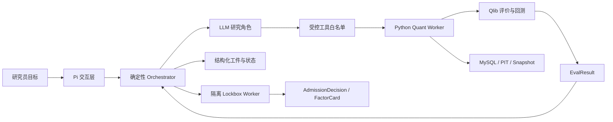
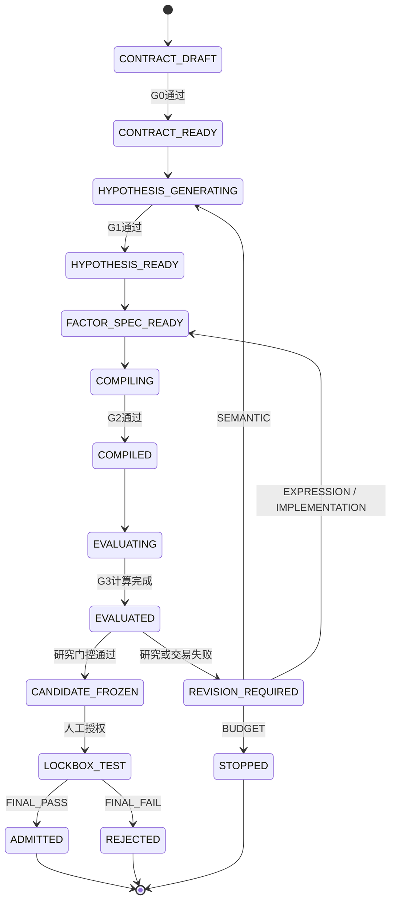
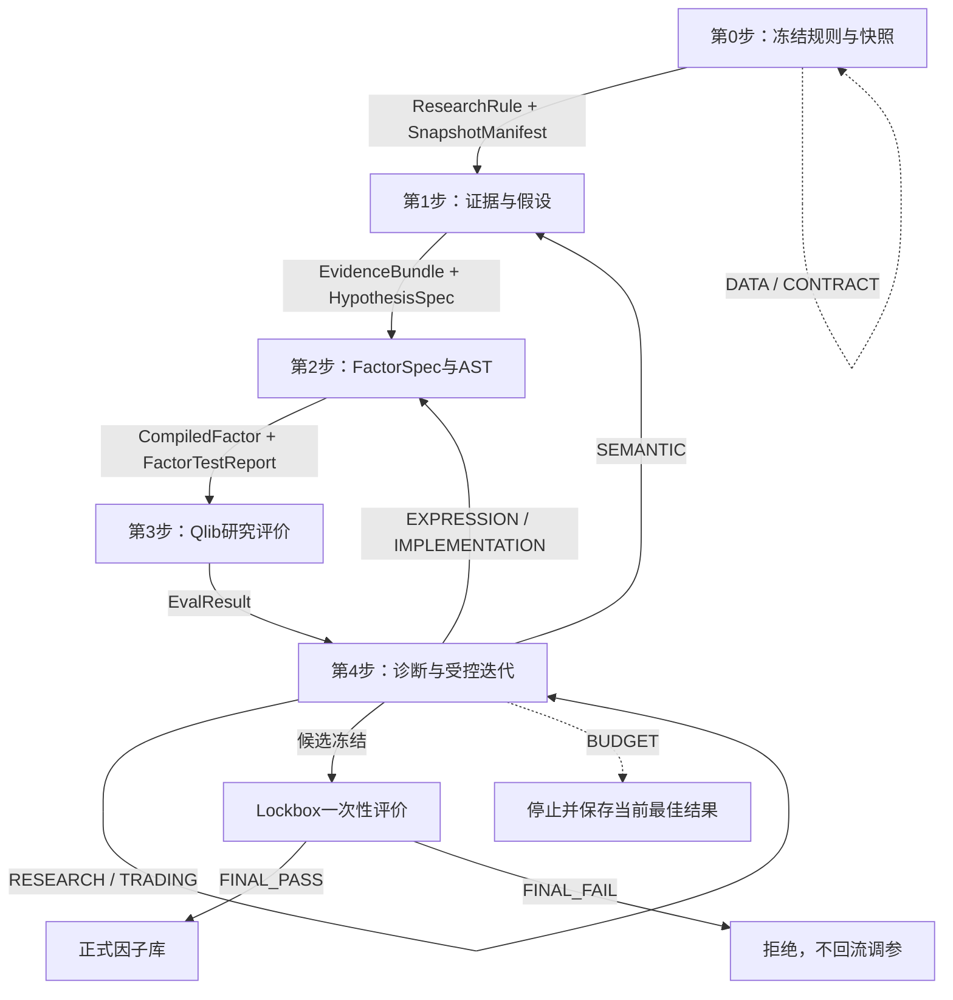

# LLM驱动的A股量化因子挖掘 Agent

## 基于 Pi Agent 的精炼项目架构与实施方案

> **项目目标**：构建面向中国A股的、可解释、可复现、可审计的量化因子挖掘系统，形成“冻结研究规则 → 提出假设 → 实现因子 → Qlib评价 → 受控迭代 → 因子准入”的完整闭环。
>
> **技术边界**：Pi负责模型接入、Agent循环、工具调用、会话与交互；确定性编排器负责状态、预算、版本和权限；Python负责因子计算与扩展算子；Qlib是唯一正式评价和回测框架；MySQL是原始研究数据和核心元数据的事实源。

---

## 1. 系统定位与不可变原则

本项目不是多个LLM自由讨论的聊天系统，而是一个由确定性程序控制、由LLM提供研究语义能力的量化研究平台。

LLM负责：

- 检索和归纳研究证据；
- 提出可证伪的经济假设；
- 将假设转化为结构化因子规格；
- 解释结构化失败结果并提出局部修改方案。

LLM不得：

- 自行计算或编造IC、RankIC、Sharpe、回撤等指标；
- 修改已冻结的股票池、标签、样本区间、成本和准入门槛；
- 直接执行任意Python、Shell或SQL；
- 绕过字段、AST、PIT和未来泄漏检查；
- 访问最终锁箱明细并据此继续调参；
- 删除或覆盖失败因子、旧实验和历史版本。

系统遵循以下原则：

| 原则 | 要求 |
|---|---|
| 单一事实源 | MySQL保存原始研究数据、元数据和工件索引；Parquet与Qlib数据仅作为有快照标识的计算缓存 |
| 单一评价口径 | Qlib负责正式因子评价、组合构建和回测；Python不建立第二套正式回测体系 |
| 结构化交接 | 步骤之间只传递有Schema、有版本的研究工件，不传递自由文本结论 |
| 最小权限 | 每个Agent和Worker只获得完成当前任务所需的字段、工具和数据权限 |
| 版本不可覆盖 | 规则、快照、假设、公式、AST、代码、算子和评价配置变更均产生新版本 |
| 锁箱隔离 | 最终样本外数据与研究流程物理隔离，结果不得反馈给搜索过程 |
| 搜索可计量 | 候选数量、评价次数、Token、计算时间和多重检验规模均可追溯 |

---

## 2. 总体架构

### 2.1 六层架构

| 层级 | 核心组件 | 职责 |
|---|---|---|
| 交互与治理层 | Pi TUI、自定义Web界面、人工审批、报告 | 创建研究任务、冻结规则、批准锁箱、查看结果 |
| LLM研究层 | Retrieval、Idea、Critic、Factor、Diagnostic角色 | 处理证据、假设、因子语义和失败解释 |
| 编排与状态层 | Orchestrator、状态机、预算、错误路由、幂等任务 | 决定何时调用Agent或Worker，以及下一合法状态 |
| 因子与评价层 | DSL、AST、编译器、Python算子、Qlib Runner | 产生确定性因子值、评价指标和回测结果 |
| 数据适配层 | MySQL Provider、FieldRegistry、PIT、Snapshot、Qlib Adapter | 保证字段含义、数据时点和样本口径一致 |
| 资产与存储层 | Artifact Store、OperatorRegistry、FactorArchive、ExperimentStore、TrajectoryStore | 保存工件、版本、血缘、实验和失败经验 |

### 2.2 Pi Agent的使用方式

Pi只作为Agent运行时和研究交互外壳，不承担量化状态机。

| Pi组件 | 本项目用途 |
|---|---|
| `@earendil-works/pi-ai` | 统一接入不同LLM供应商，记录模型、Token和费用 |
| `@earendil-works/pi-agent-core` | 提供Agent循环、工具执行、事件流和调用前后门控 |
| `@earendil-works/pi-coding-agent` SDK | 创建AgentSession、加载Extension/Skill、管理会话和TUI |
| Pi Extension | 注册结构化工具、研究命令、权限拦截和状态展示 |
| Pi Session | 保存交互记录，供调试和恢复；不作为研究工件事实源 |

原型阶段通过项目内`.pi/extensions/quant-agent`快速开发；生产阶段由TypeScript控制面直接嵌入Pi SDK，不解析终端输出，也不让LLM直接使用内置Bash和文件写入工具。

### 2.3 运行数据流



图中唯一的控制中心是Orchestrator。LLM只能通过工具提交结构化工件，不能直接修改状态、数据库或Qlib配置。

```text
用户目标
  → Orchestrator冻结ResearchRule与SnapshotManifest
  → Retrieval/Idea/Critic生成HypothesisSpec
  → Factor Agent提交FactorSpec
  → AST校验与后端编译
  → Python/Qlib确定性评价
  → Diagnostic Agent生成RevisionPlan
  → Orchestrator按错误类型返回局部步骤或冻结候选
  → 人工批准LOCKBOX_EVAL
  → AdmissionDecision与FactorCard
```

每个LLM角色使用独立AgentSession和工具白名单。只读检索工具可以并行；写库、编译、评价、冻结和准入工具必须顺序执行。

---

## 3. 统一工件与唯一交接链

### 3.1 核心工件

| 工件 | 作用 | 产生阶段 |
|---|---|---|
| `ResearchRule` | 冻结股票池、时点、标签、区间、成本、门槛和预算 | 第0步 |
| `SnapshotManifest` | 记录数据范围、PIT口径、Schema、查询与内容哈希 | 第0步 |
| `EvidenceBundle` | 保存有来源标识的证据片段 | 第1步 |
| `HypothesisSpec` | 定义机制、变量、方向、期限和证伪条件 | 第1步 |
| `FactorSpec` | 定义字段、算子、窗口、缺失值和预处理 | 第2步 |
| `CompiledFactor` | 保存可执行表达式或受控Python入口及其哈希 | 第2步 |
| `FactorTestReport` | 保存类型、PIT、泄漏、边界和一致性测试结果 | 第2步 |
| `EvalResult` | 保存Qlib因子评价、稳健性和策略结果 | 第3步 |
| `DiagnosticReport` | 对失败门控和失败类别作结构化解释 | 第4步 |
| `RevisionPlan` | 明确返回步骤、修改范围和预算消耗 | 第4步 |
| `AdmissionDecision` | 给出准入、拒绝或停止结论 | 第4步 |
| `FactorCard` | 汇总正式因子的定义、证据、风险、版本和监控要求 | 第4步 |
| `Trajectory` | 记录状态迁移、父子版本、调用、结果和费用 | 全流程 |

唯一合法交接链为：

```text
ResearchRule + SnapshotManifest
  → EvidenceBundle + HypothesisSpec
  → FactorSpec + CompiledFactor + FactorTestReport
  → EvalResult
  → DiagnosticReport + RevisionPlan / AdmissionDecision
```

禁止自然语言假设直接执行、实现完成后直接入池、回测失败后不经诊断直接重跑。

### 3.2 公共元数据

所有工件包含：

```text
project_id, run_id, artifact_id, artifact_version,
parent_artifact_id, rule_version, snapshot_id,
generation_id, phase, status, created_at, created_by,
error_code, retry_count
```

计算工件额外包含：

```text
formula_hash, ast_hash, code_hash,
operator_registry_version, field_registry_version,
qlib_config_hash, random_seed, environment_lock_hash
```

---

## 4. 状态机、门控与错误路由

### 4.1 状态机



状态表示流程走到哪里，门控结论表示当前工件是否通过，二者不能混用。

```text
CONTRACT_DRAFT → CONTRACT_READY
→ HYPOTHESIS_GENERATING → HYPOTHESIS_READY
→ FACTOR_SPEC_READY → COMPILING → COMPILED
→ EVALUATING → EVALUATED
→ REVISION_REQUIRED ─┐
                     └→ 返回第0、1或2步并创建新版本
→ CANDIDATE_FROZEN → LOCKBOX_TEST
→ ADMITTED / REJECTED / STOPPED
```

工作流状态与工件结论必须分开。例如，`EVALUATED`仅表示计算完成；是否通过由`RESEARCH_PASS`或`RESEARCH_FAIL`表示。

### 4.2 五个单一职责门控

为避免重复审查，全系统仅保留五个门控，每项检查只归属一个阶段：

| 门控 | 唯一检查内容 | 失败处理 |
|---|---|---|
| G0 契约门控 | 规则完整性、样本时点、快照和人工冻结 | 留在第0步 |
| G1 假设门控 | 证据、机制、可观测性、方向、期限和可证伪性 | 留在第1步或拒绝 |
| G2 实现门控 | 字段、类型、单位、AST、PIT、未来泄漏和实现测试 | 返回第1或2步 |
| G3 研究门控 | 数据质量、预测能力、稳健性、纯Alpha和交易性 | 进入第4步诊断 |
| G4 准入门控 | 冻结哈希、锁箱结论、血缘、风险和监控完整性 | 准入或最终拒绝 |

以下内容不再设独立审查章节，而是作为自动化不变量测试：

- 工件ID和父子版本可连接；
- 状态迁移合法；
- 哈希与实际内容一致；
- Qlib配置与实验记录一致；
- 锁箱权限和运行次数符合约束。

人工审批仅用于三类重大动作：首次冻结研究规则、修改已冻结规则、打开最终锁箱并授权“通过后自动准入”。其他门控由确定性程序执行，锁箱通过后不再重复发起准入审批。

### 4.3 错误分类与唯一返回规则

| 错误类别 | 示例 | 返回位置 |
|---|---|---|
| `DATA` | 字段缺失、快照损坏、PIT数据不可用 | 可修复则第0步；否则停止 |
| `CONTRACT` | 股票池、标签、成本或区间制度错误 | 人工批准后第0步 |
| `SEMANTIC` | 机制不清、方向错误、代理变量改变含义 | 第1步，新假设版本 |
| `EXPRESSION` | AST非法、算子不匹配、单位或轴错误 | 第2步，新因子版本 |
| `IMPLEMENTATION` | 索引、边界、性能或后端代码错误 | 第2步，新实现版本 |
| `RESEARCH` | IC弱、方向不稳、稳健性不足 | 第4步决定修改或停止 |
| `TRADING` | 换手、成本、容量或不可成交问题 | 第4步决定修改或拒绝 |
| `BUDGET` | 候选数、回测数、费用或时间耗尽 | `STOPPED` |

锁箱失败不得返回研究步骤，必须直接`REJECTED`。若重新开展研究，必须创建新研究批次并使用新的未来锁箱。

---

## 5. 第0—4步实施流程



每条回流路径只改变对应层级的版本：规则问题新建`rule_version`，假设问题新建`hypothesis_version`，实现问题新建`factor_version_id`。

### 5.1 第0步：确定研究规则

输入用户目标与数据元数据，输出冻结的`ResearchRule`和`SnapshotManifest`。

规则至少定义：

- 历史股票池及成分时点；
- ST、新股、停牌和退市处理；
- 信号可用时点与实际成交时点；
- 标签定义与持有期；
- 训练、验证、研究反馈和最终锁箱区间；
- 买卖成本、涨跌停与不可成交规则；
- 去极值、标准化和中性化方法；
- 评价门槛、搜索预算和随机种子策略。

建议首个Demo采用日频数据：t日收盘后生成信号，t+1日开盘成交，标签为t+1开盘至t+6开盘收益。财务数据按公告时点进入可用集，指数使用历史成分。

### 5.2 第1步：提出可检验假设

流程为：

```text
Evidence Retrieval → Idea → Critic → HypothesisSpec
```

`HypothesisSpec`至少包含：

```text
economic_mechanism
observable_variables
expected_direction
holding_period
applicable_universe_or_regime
falsification_conditions
pit_requirements
evidence_ids
expected_failure_modes
```

Retrieval角色只能返回实际检索到的证据；Idea角色不得计算指标；Critic角色只审查语义和可检验性，不重复执行字段、AST或回测检查。

### 5.3 第2步：实现可执行因子

正确链路：

```text
HypothesisSpec → FactorSpec → DSL AST → 静态检查
→ Qlib表达式或受控Python实现 → 测试 → CompiledFactor
```

MVP优先支持Qlib原生表达式；自定义Python只用于Qlib缺失的特殊算子和事件处理。LLM只能从`FieldRegistry`和`OperatorRegistry`选择字段与算子，不能提交任意代码。

AST检查包括：

- 算子和字段已注册；
- 时间窗口、频率、轴和单位合法；
- 不存在负滞后或未来引用；
- 缺失值、除零和极端值规则明确；
- 复杂度不超过研究预算；
- AST语义与`FactorSpec`一致。

测试包括：算子单测、黄金样本、边界日期、缺失值、PIT、未来泄漏、Python/Qlib小样本对齐和重复运行一致性。

### 5.4 第3步：Qlib评价与回测

第3步只接收已通过G2的`CompiledFactor`。所有数值由Python/Qlib确定性计算，LLM不接触原始行情矩阵，也不计算指标。

正式评价依次执行：

1. 合法性与数据质量：覆盖率、缺失率、异常值、截面数量；
2. 预测能力：IC、RankIC、ICIR、方向一致性、分层单调性；
3. 稳健性：分年度、分行业、分市值、分市场状态、参数扰动；
4. 纯Alpha：行业和市值中性化后的边际效果；
5. 交易性：换手、成本、涨跌停、停牌、容量和回撤；
6. 多重检验：根据累计搜索规模调整显著性判断。

`RESEARCH_EVAL`可向第4步返回结构化细节；`LOCKBOX_EVAL`由隔离Worker执行，只返回最终门控结论和有限摘要。

### 5.5 第4步：诊断、进化与准入

第4步读取`EvalResult`、历史轨迹和剩余预算，先确定失败类别，再决定动作：

- 假设层修改：返回第1步；
- 公式或实现修复：返回第2步；
- 研究或交易弱点可局部修正：执行一次有父版本的Mutation；
- 证据不足、结果不稳或预算耗尽：拒绝或停止；
- 全部门控通过：冻结公式、参数、代码、算子版本和配置。

Mutation必须记录父版本、修改目标、差异和预算；Crossover仅在单因子闭环稳定后启用，且要求两个父因子机制互补、数据兼容并重新通过G2和G3。

候选冻结后，系统核对冻结哈希并请求人工批准锁箱。锁箱通过且FactorCard完整时生成`ADMITTED`；锁箱失败直接`REJECTED`。

---

## 6. 数据、字段、算子与因子资产

### 6.1 数据与PIT

MySQL原始表必须保留事件时间和可用时间。财务字段至少区分报告期、公告时间、修订时间和系统入库时间；任意t日计算只能读取当时已公开的数据版本。

`SnapshotManifest`记录：

```text
snapshot_id, source_tables, schema_version,
query_or_export_hash, date_range, universe_rule,
pit_policy, row_counts, partition_hashes,
created_at, environment_lock_hash
```

Qlib缓存由指定快照生成，缓存更新必须创建新`snapshot_id`，不得静默覆盖后继续复用旧实验ID。

### 6.2 FieldRegistry

每个字段保存：名称、含义、来源表、数据类型、单位、频率、时间轴、可用时点、缺失规则、调整方式、允许操作和状态。字段注册通过后，LLM才能在`FactorSpec`中使用。

### 6.3 OperatorRegistry

每个算子保存：输入输出类型、时间或截面语义、参数范围、Qlib/Python后端、版本、代码哈希、复杂度、PIT属性和测试状态。

算子分为：

- 时间序列算子；
- 截面算子；
- 数学与逻辑算子；
- 中性化与预处理算子；
- A股交易与事件扩展算子。

算子实现变化必须创建新版本，并使依赖因子产生新的复现键。

### 6.4 因子资产分层

因子资产分为：

1. `CandidatePool`：待验证候选；
2. `FactorArchive`：所有成功与失败版本；
3. `ProductionFactorZoo`：通过锁箱与准入的正式因子；
4. `RetiredFactors`：因监控失效而退役的因子。

去重按由低到高成本执行：公式哈希、AST规范化、机制语义、因子值相关性、组合边际贡献。失败因子不删除，而是进入Archive和FailureMemory。

---

## 7. 存储、版本与复现

推荐核心表：

```text
research_projects, research_runs, research_rules,
snapshot_manifests, field_registry, operator_registry,
evidence_documents, evidence_fragments,
hypotheses, hypothesis_versions,
factor_definitions, factor_versions, factor_test_reports,
experiments, eval_results, diagnostic_reports,
revision_plans, trajectory_nodes, approvals,
lockbox_runs, admission_decisions, factor_cards
```

大规模因子值、模型文件和报告存入对象存储或按快照分区的Parquet，MySQL只保存索引、元数据、哈希和权限信息。

唯一复现键定义为：

```text
reproduce_key = hash(
  rule_version,
  snapshot_id,
  hypothesis_version,
  factor_version_id,
  operator_versions,
  code_hash,
  qlib_config_version,
  random_seed,
  environment_lock_hash
)
```

父级版本任一变化都产生新`experiment_id`和新轨迹节点，旧结果保持只读。

---

## 8. 权限、安全与锁箱


Lockbox Worker与普通研究Worker使用不同凭据和部署边界。锁箱失败不返回第1—4步，也不允许修改参数后重测。

Pi及其Extension默认继承启动进程权限，因此生产环境必须通过容器和服务边界限制能力。

建议拆分凭据：

- `market_data_reader`：只读原始行情与财务数据；
- `artifact_writer`：只写研究工件Schema；
- `qlib_worker`：读取指定快照并写实验结果；
- `lockbox_runner`：只能读取锁箱数据，且普通Orchestrator无法取得其凭据；
- `admission_service`：只写准入结论和FactorCard。

LLM工具只接受工件ID和结构化参数，不接受原始SQL、脚本路径或任意代码。日志和Pi Session不得保存API密钥、数据库密码、完整锁箱结果或模型隐式思维内容。

锁箱执行要求：

- 候选的公式、参数、代码、算子和配置已冻结；
- `frozen_hash`建立唯一约束；
- 每个候选每个锁箱批次只运行一次；
- 第4步只能收到`FINAL_PASS`或`FINAL_FAIL`及不可用于调参的摘要；
- 锁箱失败不允许修改后重测。

---

## 9. Pi Extension与工具设计

项目内Pi资源建议为：

```text
.pi/
├── extensions/quant-agent/
│   ├── index.ts
│   ├── tools/
│   ├── guards/
│   └── renderers/
├── skills/
│   ├── retrieval-agent/
│   ├── idea-agent/
│   ├── critic-agent/
│   ├── factor-agent/
│   └── diagnostic-agent/
├── prompts/
└── SYSTEM.md
```

核心命令：

```text
/new-research
/freeze-rule
/run-factor
/run-status
/approve-lockbox
/factor-card
```

核心结构化工具：

```text
get_research_rule
search_evidence
get_field_registry
get_operator_registry
submit_hypothesis
submit_critique
submit_factor_spec
get_eval_summary
submit_diagnostic
submit_revision_plan
```

`submit_*`工具执行Schema校验并以终止型工具结果结束当前Agent轮次。所有数据库写入由Orchestrator在校验成功后完成，Agent工具不直接修改状态机。

---

## 10. 推荐项目目录

```text
quant_factor_agent/
├── apps/
│   ├── control_plane/          # TypeScript + Pi SDK
│   └── researcher_console/
├── packages/
│   ├── contracts/              # JSON Schema与生成类型
│   ├── pi_quant_extension/
│   ├── artifact_store/
│   └── trajectory_store/
├── services/
│   ├── data_provider/
│   ├── quant_worker/
│   ├── qlib_worker/
│   └── lockbox_worker/
├── research/
│   ├── prompts/
│   ├── evidence/
│   └── failure_memory/
├── factor/
│   ├── dsl/
│   ├── ast/
│   ├── compiler/
│   ├── operators/
│   └── tests/
├── database/
│   ├── migrations/
│   └── views/
├── configs/
│   ├── research_rules/
│   └── qlib/
├── reports/
└── tests/
    ├── contract/
    ├── integration/
    ├── leakage/
    ├── reproducibility/
    └── lockbox/
```

---

## 11. MVP开发路线

MVP只验证“一个结构化假设能否安全转化为因子，经Qlib得到可复现结果，并根据失败类别完成一次受控迭代”。暂不开发大规模多Agent讨论、Crossover、高频、自动实盘和复杂深度学习组合。

### 阶段0：工程基础

- 建立TypeScript/Python Monorepo；
- 接入Pi SDK；
- 定义统一JSON Schema；
- 建立状态机、Artifact Store和数据库迁移。

验收：可创建研究任务，保存状态与空轨迹。

### 阶段1：数据与规则

- MySQL只读Provider；
- FieldRegistry和PIT；
- SnapshotManifest；
- ResearchRule；
- Qlib基础数据适配。

验收：相同规则、快照和环境得到相同基础数据与哈希。

### 阶段2：单因子闭环

- 人工输入一个HypothesisSpec；
- FactorSpec与基础AST；
- Qlib原生表达式路线；
- FactorTestReport；
- IC、分层和TopK回测；
- EvalResult与Trajectory。

验收：完成“放量确认的短期动量”或同类量价因子的完整流程。

### 阶段3：LLM语义角色

- Retrieval、Idea、Critic、Factor和Diagnostic角色；
- AgentSession隔离和工具白名单；
- 结构化终止工具；
- Token与搜索预算。

验收：LLM无法跳过工件、调用未授权工具或修改冻结规则。

### 阶段4：资产化与受控进化

- OperatorRegistry、FactorArchive和FactorCard；
- 公式、AST、语义和数值去重；
- 单父Mutation；
- CandidatePool和锁箱流程；
- 正式因子监控与退役。

验收：失败因子按错误类别返回正确步骤，产生新版本且保留旧轨迹。

---

## 12. 统一验收标准与限制

验收只保留一套标准，不再另设跨步骤重复审计章节。

### 12.1 正确性

- 不存在负滞后和已知未来函数；
- 财务字段按公告时点可用；
- 指数按历史成分构造；
- 标签、信号和成交时点一致；
- Python与Qlib小样本结果一致；
- 相同复现键重复运行结果一致；
- LLM不计算或伪造指标。

### 12.2 治理与安全

- 冻结参数只能通过新版本修改；
- 每个版本有父节点和差异记录；
- 失败因子和失败实验不删除；
- 搜索规模、回测次数、Token和费用可审计；
- 锁箱对研究Agent不可见且只运行一次；
- 任何正式结果可追溯到规则、快照、假设、AST、代码和配置。

### 12.3 功能闭环

- 第0—4步均有结构化输入、输出和错误码；
- 路线A（Qlib原生表达式）可完整运行；
- G0—G4门控各自只有一个负责阶段；
- 错误能够返回正确步骤并创建正确的新版本；
- 正式因子具有FactorCard、血缘、风险说明和监控规则。

### 12.4 性能与成本记录

MVP先建立基线，不预设脱离硬件和数据规模的绝对门槛。记录单因子计算、IC评价、Qlib回测时间、峰值内存、缓存命中率、并发任务数、Token和单候选总成本。

### 12.5 已知限制

- 历史有效不代表未来有效；
- LLM可能生成逻辑流畅但错误的经济机制；
- 高频搜索会增加数据窥探和多重检验风险；
- A股交易规则、数据口径和市场微观结构会变化；
- 回测成交模型不能完全复制真实市场冲击和容量；
- MVP的首要目标是证明研究流程正确，而非追求最高回测收益。

---

## 结论

本项目是一套由研究契约约束、Pi提供语义Agent能力、确定性Orchestrator控制流程、Python安全实现因子、Qlib统一评价，并通过版本化工件和轨迹完成受控进化的A股因子挖掘系统。

其最小完整闭环为：

```text
制度可冻结
→ 假设可证伪
→ 因子可执行
→ 结果可复现
→ 失败可路由
→ 搜索有预算
→ 锁箱不泄漏
→ 准入可追溯
```

## 参考资料

- [Pi Agent Harness](https://github.com/earendil-works/pi)
- [Pi Documentation](https://pi.dev/docs/latest)
- [Microsoft Qlib](https://github.com/microsoft/qlib)
- [QuantaAlpha](https://github.com/QuantaAlpha/QuantaAlpha)
- QuantaAlpha: An Evolutionary Framework for LLM-Driven Alpha Mining
